# BIM Operations Platform

[](https://github.com/Gun-stack/bim-platform/actions/workflows/ci.yml)

> IFC 모델을 웹 3D 공간으로 전환하고, 설비 계통 추적부터 운영 모니터링·자산·점검·작업지시까지 연결한 BIM 기반 시설관리 데모 웹 앱

FMS·MEP 분야의 실무 경험을 바탕으로 업무 흐름과 기술 구현을 보여주기 위해 만든 **포트폴리오용 개인 프로젝트**다. 실제 운영·상용 서비스가 아니다. 제품 기획과 도메인 모델링부터 백엔드·프론트엔드, IFC 변환 워커, 데이터베이스, Docker 실행 환경까지 엔드투엔드로 설계·구현했다. AI 페어 프로그래밍을 적극 활용해 짧은 기간에 집중 개발했고, 설계 결정·도메인 규칙·검증은 직접 판단했다.

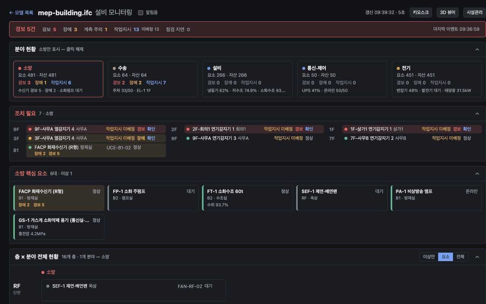

> 📐 화면 구조·기능 배치·화면 간 연관 관계·용어 사전은 [화면 설계서](docs/screen-design.md)에 정리했다. 세 화면의 역할은 **뷰어 = 어디, 모니터링 = 지금, 시설관리 = 할 일**.

## 화면으로 보는 흐름

**1. 업로드 → 변환 → 목록.** IFC를 끌어다 놓으면 서버 워커가 glTF로 변환하고 진행률이 SSE로 올라온다. 한 모델에서 3D 뷰어·모니터링·시설관리로 진입하고, 상단 링크로 운영 흐름·아키텍처 다이어그램을 연다.

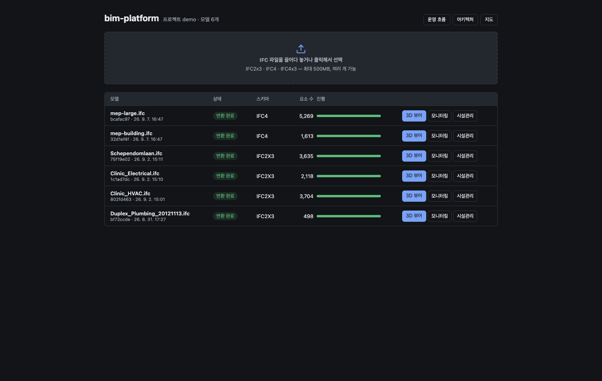

**2. 3D 뷰어 — 고르면 "무엇·어디·누가"가 한 카드에.** 요소를 클릭하면 우측 카드에 이름·상태·종류/위치·소속 계통(분야 색)·자산 태그·열린 작업지시가 모이고, 그 아래 **운영 상태**에서 경보/장애/복구와 계측값(차단기·부하 등)을 바로 고친다. 좌측 최상단 **상태판**은 어느 탭에서든 이상 목록을 보여준다. 고른 요소는 URL(`?sel=`)과 **맥락 독**(3D 썸네일 카드)에 남아 모니터링·시설관리로 넘어가도 따라간다.

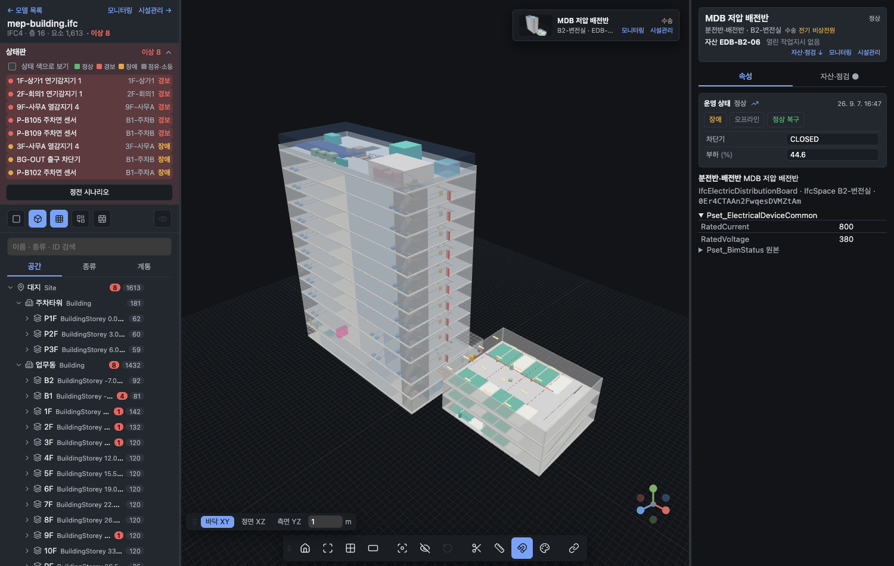

**3. 설비 계통 — 색으로 보고, 흐름을 따라간다.** 계통 탭은 분야(소방·수송·설비·통신·제어·전기)별로 묶여 있고 "계통별 색으로 보기"를 켜면 건물 안의 배관·트레이·장비가 계통 색으로 칠해진다. 장비를 고르고 **하류(말단까지)/상류(원천까지)** 를 누르면 재귀 CTE가 그래프를 따라가 3D에 경로를 칠하고, 상단 배너에 "몇 요소 · 어느 층 · 주요 종류"를 요약한다. 아래는 저압 배전반의 하류 — 지하 2층부터 옥탑까지 조명·분전반 572요소.

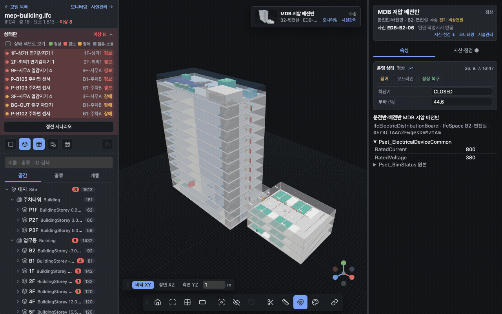

**4. 정전 시나리오 — 계통 그래프만으로 영향 범위 계산.** "정전 시나리오"를 누르면 ATS가 발전기로 절체되고, **비상분전반 하류만 초록(전원 있음), 나머지는 짙은 회색(무전원)** 으로 바뀐다. 어느 조명·분전반이 죽고 소화펌프·수신기·비상조명이 살아있는지 한눈에 보인다. 밸브 잠금·차단기 트립도 같은 계산(하류 차집합)이다.

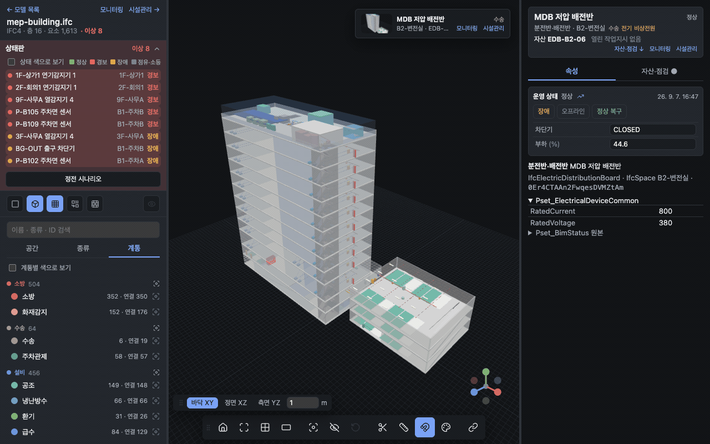

**5. 경보 포커스 — 찾아가는 사람의 화면.** 모니터링이나 상태판에서 경보를 클릭하면 뷰어가 건물 전체 뷰를 유지한 채 **해당 구역만 파랗게 강조하고 지붕 위로 비콘**을 세운다. 줌인·단면보다 "어느 층 어느 구역인가"가 먼저라는 현장 관점이다.

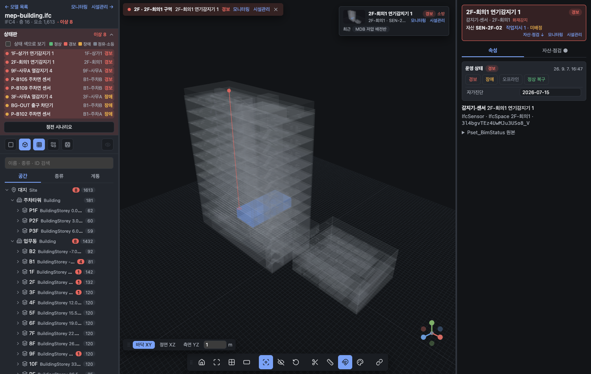

**6. 설비 모니터링 — 총계 → 분야 → 조치 필요 → 핵심 요소 → 층×분야 격자.** 첫 줄은 건물 총계(경보·장애·계측 주의·작업지시·미배정·점검 지연)이고 숫자를 누르면 그것들이 보이는 곳으로 이동한다. **조치 필요**는 경보 → 장애 → 계측 위험 → 주의 → 점검 지연 순이며, 이상 행의 **확인** 버튼이 확인 시각을 기록해 강조를 낮춘다(자동 복구는 하지 않음 — 해제는 BMS·현장 확인의 몫). 분야 카드를 고르면 그 분야의 **핵심 요소 카드**(수신기·소화펌프·변압기·냉동기…)가 계측값과 함께 뜬다. 층×분야 격자는 이상만/요소/전체로 걸러 보고, 층 라벨의 **단면** 링크는 뷰어를 그 층 높이로 잘라서 연다. 새 경보는 4초간 강조되고 알림음을 켤 수 있으며, **최근 이벤트**는 op_event 이력이라 지나간 일이 사라지지 않는다. 맨 아래 **경보 통계**는 같은 이력에서 분야별 발생 건수·평균 복구 시간·미복구·재발 요소(7·30·90일)를 낸다 — 격자가 "지금"이라면 통계는 "얼마나 자주, 얼마나 오래". 분야·층·모드·기간 필터는 전부 해시 쿼리라 "소방 이상만" 화면을 그대로 공유할 수 있다.

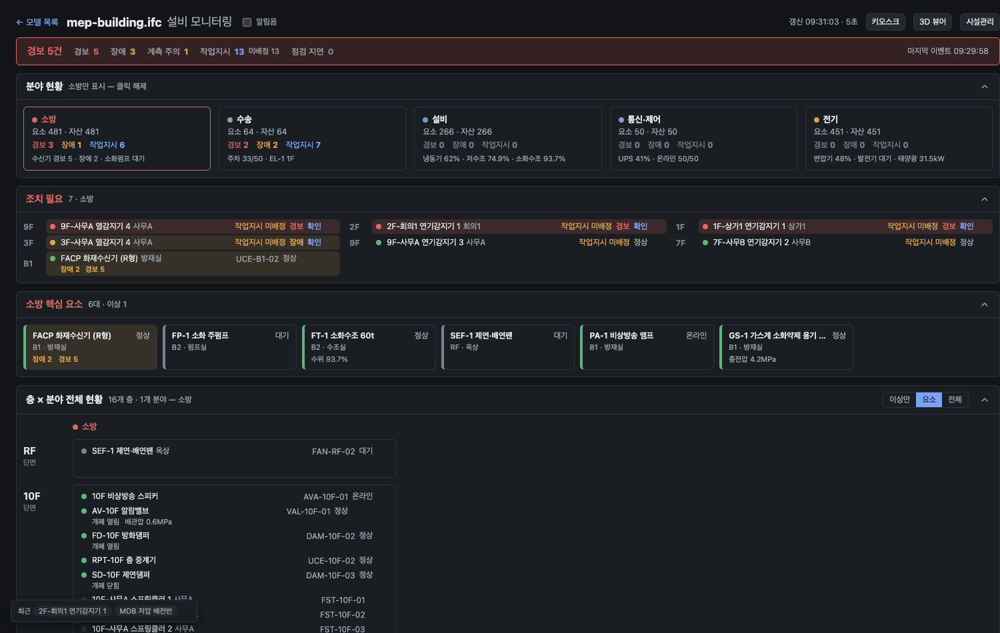

계측값이 있는 요소는 행·카드의 **트렌드** 링크와 뷰어 운영 상태의 📈로 **계측 트렌드**(op_event 시계열)를 연다.

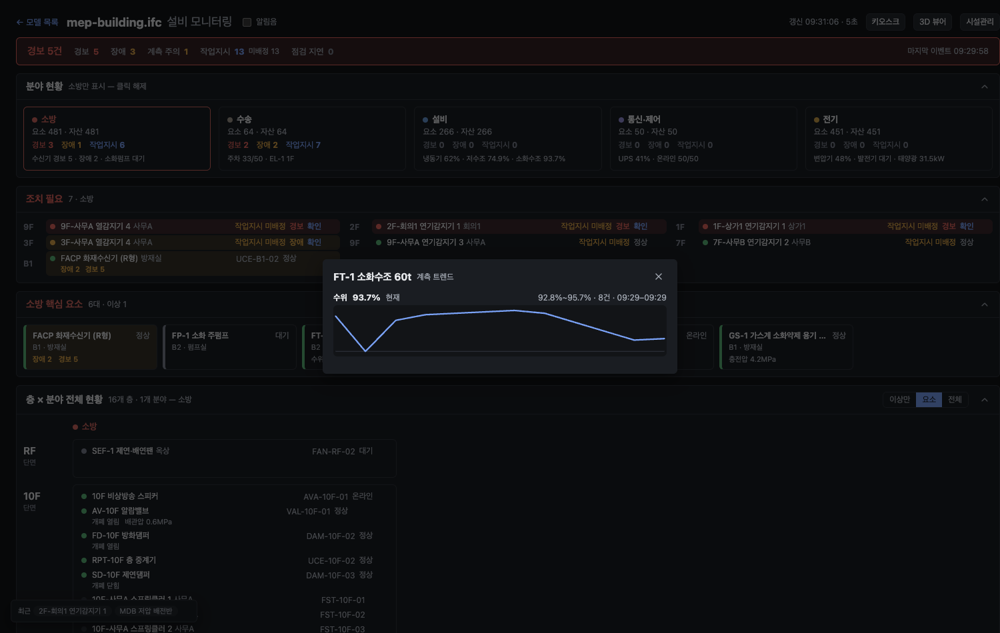

헤더의 **키오스크** 버튼(`?kiosk=1`)은 내비를 숨기고 글자를 키워 관제실 TV에 띄우는 벽면 모드다. 현재 필터를 유지한 채 들어가고 나온다.

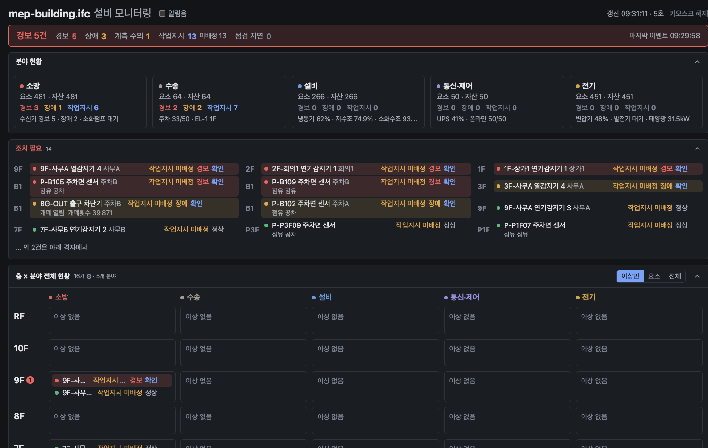

**6-1. 화면을 옮겨도 요소는 그대로.** 모니터링 행을 누르면 뷰어로 튀지 않고 같은 화면 오른쪽에 **객체 패널**(요약·운영 상태·자산/점검/작업지시)이 열린다. 세 화면의 내비 링크가 선택(`?sel=`)을 끌고 가고, 좌하단 **맥락 독**은 뷰어에서 본 마지막 3D 장면을 썸네일로 들고 다니며 3D/시설관리로 한 번에 옮겨 준다. 최근 본 요소 칩으로 되돌아갈 수 있고, 독은 끌어서 옮긴다.

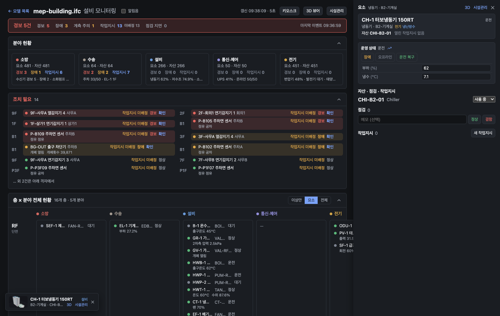

**7. 시설관리 — 경보가 작업지시가 되어 보드에 쌓인다.** 감지기 경보·장비 장애는 자산이면 **작업지시가 자동 생성**된다(상위 장비 억제·열린 건 재사용·10분 재발 재오픈). 보드는 대기/진행/완료 칸반으로 드래그 이동은 즉시 반영되고 되돌릴 수 있으며, 카드의 3D 링크는 저장된 뷰포인트로 뷰어를 연다. 작업지시를 완료했는데 장비가 아직 경보면 토스트에서 **정상 복구**를 한 번에 누른다. 완료 열처럼 쌓이기만 하는 열은 접어 둔다.

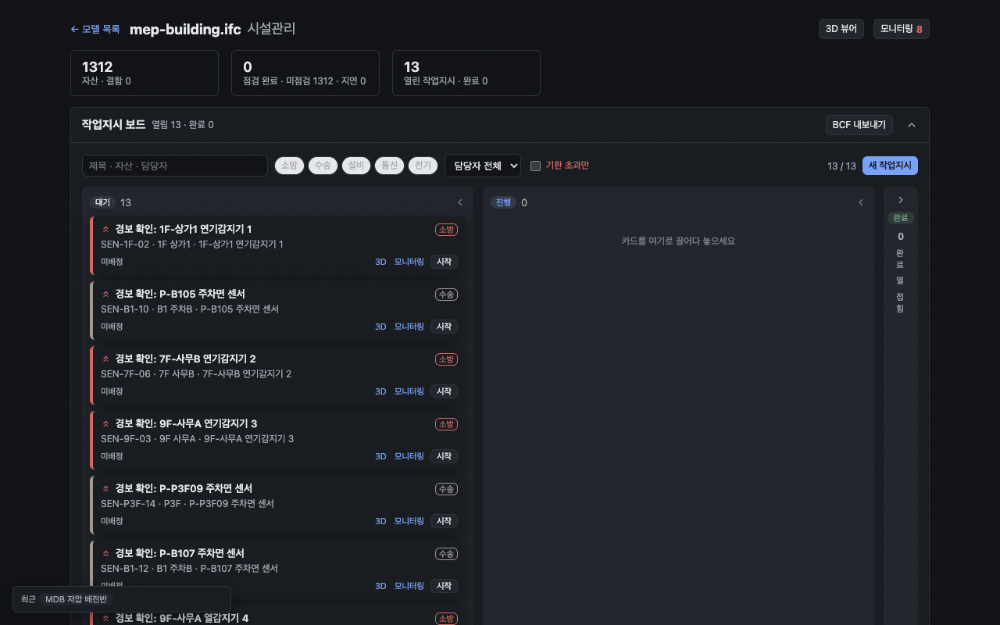

**자산 대장**은 IFC 요소에서 일괄 등록한 자산(태그 = 종류-층-순번)을 분류·층으로 걸러 보고, 모델에 없는 장비(추가 설치분)는 태그만으로 추가한다. 자산에 점검 주기(개월)를 두면 다음 점검일이 계산되고, **지연**과 **예정 30일** 필터로 예방정비를 계획한다. 지연 자산 행에서는 작업지시를 바로 만든다. COBie·BCF 내보내기는 각각 자산 대장·작업지시 보드 헤더에 있다.

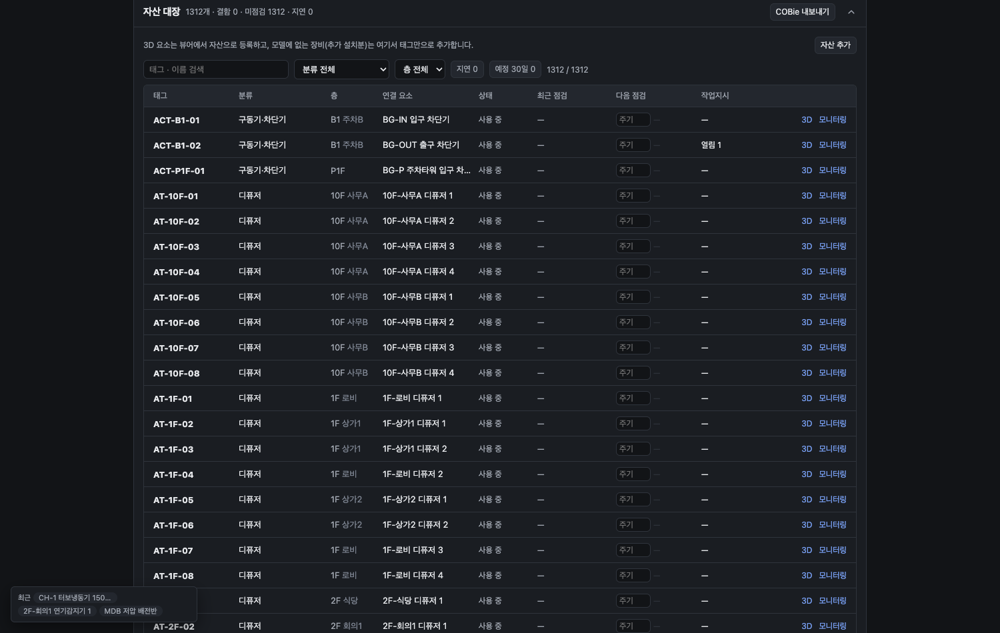

**8. 실무 IFC — 업로드만으로.** buildingSMART의 Revit 배관 모델(Duplex Plumbing, IFC2x3)을 올리면 포트 연결(`IfcRelConnectsPorts`) 485건이 방향 그래프가 되고, IfcSystem이 없어도 Pset(System Classification)에서 **계통 7개가 유도**된다. 자산 일괄 등록(장비 40대)까지 버튼 하나 — 아래는 업로드 직후의 모니터링. Clinic HVAC(27MB, 포트 7,390·연결 3,695)은 요소 3,704개가 전부 IfcFlowTerminal 같은 IFC2x3 일반 클래스인데, 타입(IfcAirTerminalType 등)으로 구체 클래스를 되찾아 디퓨저 440·VAV 115·팬 8·냉동기 1이 장비로 잡히고 덕트·피팅 3,100개는 빠진다. 같은 저장소의 Clinic Electrical은 포트 연결이 0건이라(IFC2x3 Coordination View는 전기 회로를 내보내지 않음) 조명·콘센트 분류까지만 되고 추적은 안 된다 — 입력 데이터의 한계로 두었다.

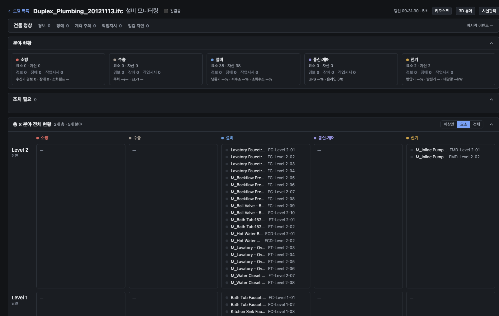

**9. 가상 건물.** 위 화면의 건물은 IfcOpenShell API로 직접 생성한 36×16 m 업무동(지상 10층·지하 2층·옥탑)과 주차타워(3층)다 — 실무 관행대로 B2 변전·발전기·기계·수조실, B1 주차장·방재·통신·주차관제실, 옥탑 보일러실, 계단실 2개소, 17% 차량 램프, 슬래브 개구부. 14계통 1,613요소 2,005연결에 운영 상태 초기값이 들어 있어 위 시나리오를 바로 돌려볼 수 있다. `gen_mep.py`는 `--floors/--annex/--density`로 층수·부속동(주차타워·후생동)·말단 밀도를 바꾸고, 대형 인자(20층·부속동 2·격자 2.5 m)는 규모 측정과 3D Tiles 기준선으로 쓴다.

| B1 주차장·방재실 (층 단면) | 에스컬레이터 1F↔2F |
|---|---|
| 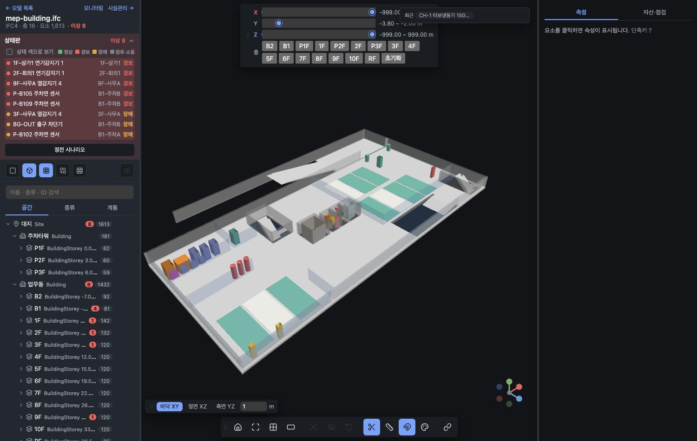 | 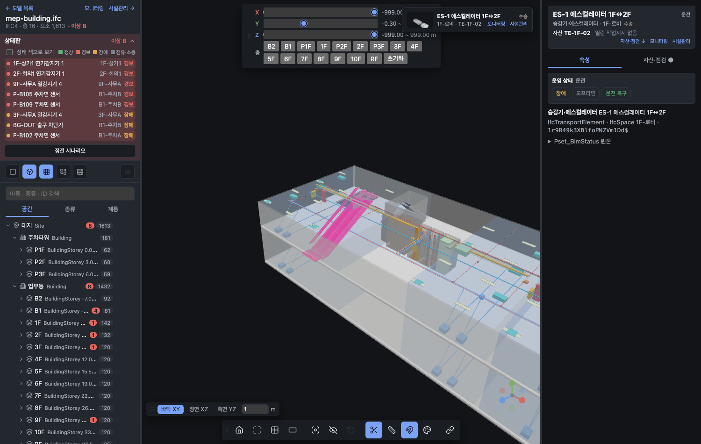 |

## 핵심 구현

- **IFC 변환 파이프라인** — Python·IfcOpenShell 워커가 IFC를 glTF로 변환하고 요소, Pset, 공간 계층, 설비 계통, 연결, 지리참조를 PostgreSQL/PostGIS와 MinIO에 적재한다. IFC2x3 일반 클래스는 타입으로 구체 클래스를 복원하고, IfcSystem이 없으면 Pset에서 계통을 유도한다.
- **장애에 강한 DB 잡 큐** — PostgreSQL `FOR UPDATE SKIP LOCKED`와 lease owner, heartbeat, 재시도로 중복 실행과 중단 작업을 관리한다. 별도 메시지 브로커 없이 변환 신뢰성을 확보했다.
- **방향성 MEP 그래프** — IFC 계통과 요소 연결(`IfcRelConnectsElements`, 실무 IFC의 `IfcRelConnectsPorts` 포트 연결 포함)을 저장하고 재귀 CTE로 상류 원천과 하류 영향 범위를 추적한다. 같은 구조로 일반·비상전원의 정전 영향도 계산한다.
- **운영 상태에서 업무로 연결** — JSONB 상태 병합 API와 함께 상위 원인 설비 경보 억제, 열린 작업지시 재사용, 완료 직후 재발 처리 규칙을 구현했다. 상태·작업지시 변경은 op_event 이력으로 남고, 이벤트 목록·계측 트렌드·경보 통계(에피소드·MTTR·재발)·경보 확인 시각이 여기서 나온다.
- **BIM 3D 탐색 경험** — Three.js 기반 요소 선택·검색, 속성·계통 트리, 단면(층 버튼), 측정, 격리, 색상화, 다중 선택, 뷰포인트 공유, 재질별 병합 렌더.
- **BIM과 FMS 수명주기 분리** — IFC 연결이 없는 자산도 관리하며, 모델을 재변환해도 자산·점검·작업 이력이 보존되도록 운영 데이터를 분리했다. COBie(CSV zip)·BCF 2.1(topic·viewpoint) 내보내기로 표준 산출물과 잇는다.

## 아키텍처

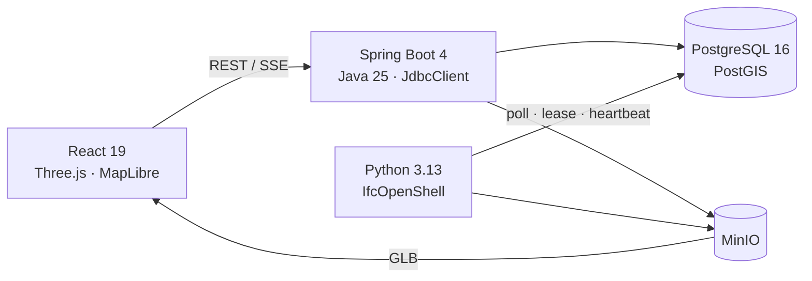

Docker Compose가 `web`, `api`, `ifc-worker`, `postgis`, `minio`를 실행한다. 브라우저는 SSE로 변환 진행률을 받고, GLB의 IFC GlobalId 노드를 API의 요소 데이터와 연결한다.

> 🗺️ 탐색형 다이어그램([Archify](https://github.com/tt-a1i/archify)로 생성, 모델 목록 화면 상단 링크로도 열림):
> - 운영 흐름 [web/public/flow.html](web/public/flow.html) — 업로드→변환→운영→작업지시 4개 뷰, 원본 [docs/flow.archify.json](docs/flow.archify.json)
> - 아키텍처 [web/public/architecture.html](web/public/architecture.html) — 요청 경로·변환 파이프라인·GLB 전달 3개 뷰, 원본 [docs/architecture.archify.json](docs/architecture.archify.json)

```text
project ─ model ─ element ─ asset ─┬─ inspection
             │        │            └─ work_order (viewpoint)
             │        └─ op_event (상태·계측·작업지시 이력, append-only)
             ├─ spatial_node
             ├─ system ↔ element_system
             ├─ connection (upstream → downstream)
             └─ conversion_job
```

## 설계 결정

| 결정 | 이유 |
|---|---|
| Java API + Python IFC 워커 | 트랜잭션 중심 API와 IfcOpenShell 기하 처리의 책임 분리 |
| 서버에서 IFC → GLB 변환 | 브라우저 파싱 부담을 줄이고 결과물을 캐시·배포하기 쉽게 구성 |
| PostgreSQL 잡 큐 | 소수 워커와 분 단위 작업에 맞춰 운영 구성요소 최소화 |
| 요소 간 방향 그래프 | 원천 → 말단 추적과 재귀 CTE 기반 영향 범위 계산 |
| 운영 정보는 IFC 밖에 저장 | 설계 원본과 운영 이력을 분리해 재변환에도 FMS 데이터 보존 |
| 상태 변경을 이력으로 append | 현재값만 두면 "언제부터 이랬나"에 답할 수 없음 — 트렌드·통계·확인 시각의 단일 원천 |
| 화면 이동은 전부 해시 딥링크 | 공유·북마크 가능, 씬 재로드 없음, 새 기능도 `?sel=` 체계 재사용 |

## 도메인 관점

- **긴 운영 수명주기를 고려한 구조** — 준공 IFC를 직접 수정하지 않고 그 위에 자산·점검·작업지시·운영 상태를 쌓는다.
- **표준 확장을 고려한 데이터 모델** — COBie의 자산·작업 개념과 BCF topic·viewpoint의 주요 필드를 대응시켜 내보내기를 제공하고, 정식 xlsx·BCF 왕복으로 확장할 수 있게 설계했다.
- **현장 중심의 계통 해석** — 전기·소방·설비·통신·제어·수송 분야 기준 상태판과 원천 → 말단 그래프를 결합해 경보 위치뿐 아니라 원인과 영향 범위를 함께 보여준다.

## 실무 BIM 툴체인에서의 위치

| 단계 | 현장 도구 | 이 플랫폼과의 관계 |
|---|---|---|
| 저작 | Revit · ArchiCAD · Tekla | IFC로 내보낸 결과를 입력받음(IFC2x3 Coordination View, IFC4 Reference View). 저작 도구의 원본은 건드리지 않음 |
| 조정·검토 | Navisworks · Solibri · BIMcollab | 간섭 검토·이슈(BCF)는 이쪽 몫. 작업지시를 BCF 2.1(topic·viewpoint zip)로 내보내 이슈를 조정 도구로 되넘길 수 있음 |
| 공통 데이터 환경(CDE) | Autodesk Construction Cloud(BIM 360) · Trimble Connect | 준공 IFC의 출처. 플랫폼은 CDE에서 받은 파일을 변환·저장(MinIO)해 운영 데이터를 덧붙임 |
| 인수인계 | COBie 스프레드시트 | Component/Type/Job 개념을 자산·점검·작업지시로 축소 반영, COBie 시트(CSV zip) 내보내기 제공. 정식 xlsx 는 다음 단계 |
| **운영** | **BMS · 화재수신기 · 주차관제 · FMS** | **이 플랫폼의 자리.** BMS/수신기 값은 상태 API(`PATCH …/status`)로 들어오고, 경보 → 확인 → 작업지시 → 현장 위치까지 이어짐 |

## 기술 스택

- **Backend:** Java 25, Spring Boot 4.1, Spring MVC + 가상 스레드, JdbcClient, Flyway, springdoc
- **Data / Storage:** PostgreSQL 16, PostGIS 3.4, MinIO
- **IFC Worker:** Python 3.13, IfcOpenShell 0.8.5, psycopg, pyproj
- **Frontend:** React 19, TypeScript, Vite, Three.js, MapLibre GL — 디자인 토큰 한 표(`theme.ts`)로 다크 관제실 테마, 색은 상태·분야에만
- **Quality / Ops:** JUnit 5, Testcontainers, Python unittest, Vitest, oxlint, GitHub Actions, Docker Compose, nginx

## 규모 측정

공개 샘플 중 가장 큰 것들과 생성기의 대형 인자로 어디가 먼저 막히는지 쟀다 (로컬 Docker, MacBook Pro M4 Pro, 헤드리스 Chrome — 로드 시간·draw calls 만 비교값으로 쓰고 fps 는 제외).

| 모델 | IFC | 요소 | 변환 → READY | GLB | 뷰어 로드 | draw calls (병합 전 → 후) |
|---|---|---|---|---|---|---|
| Schependomlaan (건축, IFC2x3) | 47 MB | 3,635 | 12.6 s | 16.6 MB | 3.4 s | 4,671 |
| Clinic HVAC (설비, IFC2x3) | 27 MB | 3,704 | ~20 s | 36.1 MB | 3.4 s | 3,968 → **3** (병합 9 s) |
| Clinic Electrical (전기, IFC2x3) | 6 MB | 2,118 | 8.3 s | 26 MB | 3.4 s | 5,055 |
| 가상 건물 (IFC4, 기본) | 2.3 MB | 1,613 | 0.9 s | 12.8 MB | 1.0~1.7 s | 1,808 (병합 미측정) |
| 가상 건물 대형 (IFC4, `--floors 20 --annex 2 --density high`) | 7.2 MB | 5,269 | 2.6 s | 48.9 MB | 2.0~3.8 s | 5,609 → 30 |

대형 가상 건물의 생성 시간(`gen_mep.py`, 워커 컨테이너 내부)은 34.2 s.

먼저 막히는 곳 셋과 조치:

- **모니터링 API가 자산 수에 비례** — 자산 566개 모델에서 130 ms. `EXPLAIN` 결과 inspection·work_order 의 FK 열에 인덱스가 없어 자산마다 seq scan(서브플랜 loops=566×4). FK 인덱스 4개로 **23 ms** (쿼리 415 → 16 ms).
- **GLB 전송량** — 36 MB 는 로컬에선 0.2 s 지만 인터넷에선 병목. glTF 바이너리가 gzip 에 잘 눌려(36 → 5 MB) nginx 에 `model/gltf-binary` 압축을 켰다. 전송 **7.3 MB**. Draco/meshopt 는 다음 단계.
- **draw calls** — 요소당 메시 하나라 4~5천. 뷰어의 "병합 렌더"가 재질별로 합쳐 **3~30 개**로 줄이지만 4천 메시 병합에 9 s 가 걸리고 픽킹은 병합 범위 역추적으로 유지한다. 기본은 끔(선택·격리가 잦은 편집 화면), 관제 벽면처럼 보기만 할 때 켠다.

요소 목록 API(527 KB / 29 ms)·공간 트리·계통 조회는 이 규모에서 병목이 아니다. 10만 요소·수백 MB 급은 3D Tiles 나 스트리밍 로드가 필요한 다른 문제라 여기서 다루지 않는다.

## 빠른 실행

```bash
cp .env.example .env
docker compose up -d --build --wait
```

웹 화면: [http://localhost:5173](http://localhost:5173)

> `.env.example`은 로컬 데모용. 외부에 열 때는 `.env`의 `BASIC_AUTH_USER`/`BASIC_AUTH_PASSWORD`를 채우면 nginx가 화면·API·glb 전부에 Basic 인증을 건다(단일 계정 — 계정별 권한은 다음 단계). TLS는 앞단 리버스 프록시 몫이며, api·DB·MinIO 는 127.0.0.1 에만 바인딩된다.

<details>
<summary>샘플 IFC 생성과 BMS 이벤트 시뮬레이션</summary>

공개 샘플 다운로드와 생성 인자는 [`samples/README.md`](samples/README.md)에 있다. 호스트에 IfcOpenShell 이 없어 생성은 워커 컨테이너에서 한다.

```bash
docker compose exec ifc-worker rm -rf /tmp/gen && docker compose cp samples/gen ifc-worker:/tmp/gen
docker compose exec ifc-worker sh -c 'cd /tmp/gen && python gen_mep.py mep-building.ifc'                                 # 기본: 지상 10층 + 주차타워
docker compose exec ifc-worker sh -c 'cd /tmp/gen && python gen_mep.py large.ifc --floors 20 --annex 2 --density high'  # 대형
docker compose cp ifc-worker:/tmp/gen/mep-building.ifc samples/
python3 samples/gen/bms_sim.py <modelId>        # 상태 API 시뮬레이터 (경보·계측·복구)
```
</details>

<details>
<summary>개발·테스트 명령과 주요 화면 경로</summary>

```bash
(cd api && ./gradlew test)
(cd ifc-worker && python3 -m unittest discover -s tests)
(cd web && npm ci && npm run lint && npm test && npm run build)
(cd samples/gen && python3 -m unittest test_mep_plan)
```

- `#/` — 모델 목록과 IFC 업로드
- `#/models/{id}` — 3D 뷰어 (`?sel=` 선택, `?focus=1` 경보 포커스, `?clip=` 단면, `?v=` 카메라, `?wo=` 작업지시 뷰포인트)
- `#/models/{id}/monitor` — 설비 모니터링 (`?team= storey= mode= days=` 필터, `?kiosk=1` 벽면 모드)
- `#/models/{id}/fm` — 자산 대장·작업지시 보드 (`?wo=` 카드, `?due=1` 지연 자산, `?assignee=none` 미배정)
- `#/map` — GIS 지도

API 문서(springdoc): [http://localhost:8080/swagger-ui.html](http://localhost:8080/swagger-ui.html) · `GET /v3/api-docs`. 응답이 JSON 맵이라 스키마는 비어 있고, 응답 타입은 [`web/src/api.ts`](web/src/api.ts)가 계약이다.
</details>

<details>
<summary>저장소 구조</summary>

```text
api/          Spring Boot API, DB migration, 통합 테스트
ifc-worker/   IFC 변환·추출 워커와 lease/retry·포트 연결 테스트
web/          React UI, Three.js 뷰어, 모니터링·시설관리·지도
samples/      IFC 안내, 가상 건물 생성기(gen_mep.py·mep_plan.py), BMS 시뮬레이터
docs/         화면 설계서, 다이어그램 원본(archify), 설계·구현 계획서
images/       README 스크린샷·GIF
compose.yaml  로컬 실행 환경
```
</details>

## 현재 범위와 다음 단계

- **되는 것** — IFC2x3/IFC4 업로드·변환, 계통 추적과 정전 시나리오, 운영 상태·이력·트렌드·통계, 경보 확인, 자산·점검 주기·작업지시 자동 생성, COBie/BCF 내보내기, 실무 IFC 의 포트 연결·계통 유도·클래스 복원.
- **다음** — 대규모 모델을 위한 3D Tiles(대형 가상 건물이 기준선), COBie 정식 xlsx, 계정별 권한 관리(지금은 nginx Basic 단일 계정)와 외부 공개 배포 구성(TLS·도메인).
- **입력 한계로 둔 것** — IFC2x3 전기 모델은 회로 연결을 내보내지 않아 추적 불가(Clinic Electrical, 포트 0).
