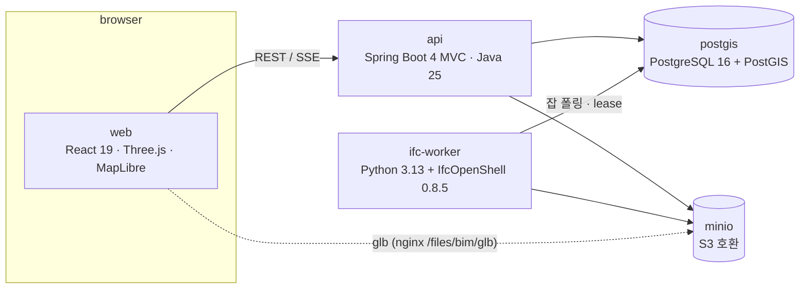

# bim-platform

IFC 건물 모델을 올리면 서버에서 변환해 **웹 3D로 보고**, **설비 계통(전기·소방·공조…)을 그래프로 추적**하고, **운영 상태(경보·장애·계측값)를 모니터링**하며, **자산·점검·작업지시(FMS)** 로 이어지는 BIM 운영 플랫폼입니다. 백엔드·변환 파이프라인·프론트를 한 사람이 처음부터 설계·구현했고, `docker compose up` 한 번으로 전부 뜹니다.

| 3D 뷰어 — 계통별 색 · 상류/하류 추적 | 설비 모니터링 — 팀 × 층 상태판 |
|---|---|
|  |  |
| **경보 포커스** — 구역 강조 + 위치 비콘 | **작업지시 칸반** — 드래그 · 우선순위 · 팀 색 |
|  |  |
| **정전 시나리오** — 발전기 절체 시 전원 유무를 흐름 그래프로 | **가상 건물** — B2 주차장·주차관제, 옥탑 보일러실, 계단·램프·개구부 |
|  |  |

## 무엇을 보여주려 했나

| 영역 | 구현 |
|---|---|
| **BIM 데이터 파이프라인** | IFC 업로드 → 잡 큐 → Python 워커(IfcOpenShell)가 glTF 변환 + 요소·속성(Pset)·공간 계층·계통·연결·지리참조 추출 → PostgreSQL/PostGIS + MinIO. 진행률 SSE, 실패 재시도, 워커 lease/heartbeat로 좀비 잡 회수 |
| **플랫폼 백엔드** | Java 25 · Spring Boot 4 MVC(가상 스레드) · JdbcClient · Flyway. 제약은 DB CHECK/UNIQUE에 두고 앱은 400으로 매핑. Testcontainers 통합 테스트 |
| **3D 뷰어** | Three.js. 요소 선택 → 속성, 공간/종류/계통 트리, 검색, 단면(층별), 측정, 격리/솔로, 속성별 색상, 뷰포인트 URL 공유, 우클릭 메뉴, 다중 선택 |
| **설비 계통(MEP)** | IFC `IfcDistributionSystem` + `IfcRelConnectsElements` → `connection` 그래프. PostgreSQL 재귀 CTE로 **상류(원천까지)/하류(말단까지)** 추적. 14계통 474요소 521연결의 가상 업무동을 IfcOpenShell API로 직접 생성 |
| **운영 상태 · 모니터링** | `Pset_BimStatus` jsonb 병합 API(BMS 연동 자리). 경보/장애 → 작업지시 자동 생성(상위 장비 억제·중복 재사용·10분 시간창), 수신기·주차관제 집계는 서버가 계산. 팀 × 층 상태판, 계측값 사전(단위·주의/위험 범위), 최근 이벤트, 새 경보 강조·알림음, 정전 시나리오, 키오스크 모드 |
| **FMS** | 요소 → 자산(태그·분류·IFC 속성 스냅샷) → 점검(OK/결함) → 작업지시(뷰포인트 저장). 지라형 칸반(낙관적 드래그·되돌리기), 자산 대장 필터, 상태 동기화 |
| **GIS** | IfcMapConversion / IfcSite 위경도 → PostGIS 풋프린트 → MapLibre 지도, 지리참조 없는 모델은 수동 배치 |
| **운영 품질** | 규모 측정(2만 요소 합성), gzip, 자격증명 `.env`, 내부 포트 로컬 바인딩, nginx 프록시 최소화·보안 헤더·레이트리밋 |

## 아키텍처



컨테이너 5개(web·api·ifc-worker·postgis·minio). 메시지 브로커·Redis 없음 — 잡 큐는 PostgreSQL 테이블(`FOR UPDATE SKIP LOCKED`).

**업로드 → 뷰어 흐름**: `POST /api/projects/{pid}/models`(multipart) → S3 `models/{id}/source.ifc` → `model(UPLOADED)` + `conversion_job(PENDING)` → 워커가 잡을 잡고(`lease_owner`, 30초 heartbeat) IfcOpenShell `geom.iterator` + `serializers.gltf`로 glb 생성 → `element`(GlobalId·클래스·Pset jsonb)·`spatial_node`·`system`·`connection` 벌크 insert → `model(READY)` → 브라우저는 SSE로 진행률을 받고 glb를 로드. glb 노드 이름 = IFC GlobalId라 별도 ID 매핑 테이블이 없다.

### 데이터 모델 (요지)

`project` → `model` → `element`(jsonb Pset, GIN) / `spatial_node`(Site→Building→Storey→Space, adjacency list) / `system` ↔ `element_system`(N:M) / `connection`(from=상류, to=하류) · `asset`(요소 선택적 FK — 모델에 없는 장비도 등록) → `inspection` → `work_order`(viewpoint jsonb = BCF viewpoint 축소판, priority) · `conversion_job`(1:N, attempts·heartbeat_at·lease_owner, 모델당 활성 잡 1개 부분 unique). 상태 enum은 전부 DB `CHECK`.

### 주요 결정과 이유

| 결정 | 이유 |
|---|---|
| API는 Java, IFC 처리는 Python 사이드카 | 기하 엔진·IDS·BCF·COBie 생태계가 Python(IfcOpenShell)에 있고, Java IFC 라이브러리는 기하가 없거나 AGPL. 경계는 DB 테이블과 오브젝트 키뿐 |
| 서버에서 glTF 변환, 브라우저에 IFC 파서 없음 | 대용량 IFC를 클라이언트가 파싱하면 기기 한계. glb는 캐시·CDN·모바일에 유리 |
| Spring MVC + JdbcClient + 가상 스레드 (WebFlux/R2DBC 대신) | 워크로드가 짧은 SQL 다수 + 파일 업로드. 가상 스레드면 블로킹 코드로도 동시성 충분, 트랜잭션·jsonb·재귀 CTE가 JDBC가 훨씬 단순 |
| 잡 큐 = PostgreSQL 테이블 | 워커 1~3개, 분 단위 잡. 브로커는 컨테이너·장애 지점만 늘림. lease/heartbeat로 hang 회수, 부분 unique로 중복 변환 방지 |
| IfcConvert 바이너리 대신 `ifcopenshell.geom` API | 요소 수·진행률을 코드에서 다루고 속성 추출과 같은 프로세스에서 처리 |
| 흐름 연결은 포트 대신 요소 간 관계 | 포트는 요소당 객체 2개 이상 늘고 결국 방향 플래그. 원천→말단을 관계 하나로. 실무 파일(`IfcRelConnectsPorts`)은 변환기 하나 더 붙이면 됨 |
| 팀 ↔ 계통 매핑을 프론트 한 곳(`teams.ts`) | 모니터 격자·보드 색·뷰어 계통 탭이 같은 표를 씀. 순서가 곧 우선순위 |
| 운영 상태는 IFC가 아니라 DB의 것 | IFC는 설계 정보. 재변환하면 상태는 초기값으로 리셋(의도). 파생값(수신기 집계·주차 점유)은 서버가 계산 |
| MapLibre 2D (Cesium 3D Tiles는 보류) | 건물 배치·풋프린트에는 2D면 충분. 3D Tiles는 다음 단계 |

## 도메인 이해 — FMS와 MEP를 어떻게 읽고 설계에 옮겼나

### FMS: 설계·시공은 1~3년, 운영은 30~50년

| 단계 | 누가 | 모델을 |
|---|---|---|
| 설계 | 건축가·설계사 (Revit·ArchiCAD) | 만들고 고친다 |
| 시공·검토 | 시공사·발주처·감리 (Speckle·BIMcollab·ACC) | 보고, 검토하고, 이슈를 꽂는다 |
| **운영** | **시설관리자 (FMS)** | **준공 모델 위에 운영 정보를 쌓는다** |

이 플랫폼은 세 번째 줄입니다. 그래서 **IFC write-back은 범위 밖** — 플랫폼이 기하를 고치면 저작 도구 원본과 어긋나므로, 하는 "쓰기"는 모델 위에 정보를 덧붙이는 것(자산·점검·작업지시·운영 상태)뿐입니다.

FMS의 핵심 순환은 **자산 → 점검 → 결함 → 작업지시 → 완료 → 이력**이고, 기존 FMS의 자산은 "엑셀 대장 한 줄"이라 "3층 방화문 #12가 어디인가"는 담당자 머릿속에 있습니다. BIM이 붙으면 달라지는 것 세 가지를 그대로 구현했습니다: 작업지시를 열면 **뷰어가 그 요소로 이동**(`work_order.viewpoint`), 자산 등록 시 **IFC Pset(제조사·정격·설치층)을 재입력 없이 스냅샷**, 뷰어에서 **여러 요소를 골라 한 번에 자산 등록**.

경험에서 온 설계 두 가지:
- **`asset.element_id`는 nullable, `model_id`는 NOT NULL** — 준공 후 설치한 CCTV·소화기·임차인 장비는 IFC에 없고, 실제 FMS에서 모델에 없는 자산이 절반을 넘기도 합니다. 3D 연결은 선택, "어느 건물 소속"은 강제. 모델을 재변환하면 `element_id`만 `SET NULL` — 자산과 이력은 살고 3D 연결만 끊깁니다(FMS 데이터가 BIM보다 오래 삽니다).
- **COBie·BCF는 필요한 부분만 축소** — COBie Component ≈ `asset`(벽·슬래브가 아니라 유지보수 대상만 자산), Type은 `category + attributes`로 단순화, Job은 `inspection·work_order`. BCF 3.0 topic(title·status·assigned_to·due_date)은 `work_order`와 1:1, viewpoint(camera·selection·clipping)는 뷰어 URL과 같은 필드 `{v, sel, clip}`로 jsonb에. 정식 `.bcfzip`·COBie 내보내기는 필드가 이미 맞아 변환기만 붙이면 됩니다.

### MEP: 계통은 "원천 → 말단"의 방향 그래프

| 계통 | 원천 → 말단 | 실무 포인트를 모델에 넣은 것 |
|---|---|---|
| 전기 | 22.9kV 수전반 → 계량 → 변압기 → MDB → MCC/층 분전반 → 구역 분전반 → 조명·콘센트 | 동력(펌프·팬·냉동기·AHU)은 MCC, 조명제어반은 통신 계통에도 걸리지만 전기팀 |
| 비상전원 | 발전기 → **ATS**(한전/발전 절체) → EMDB → UPS → 수신기·방송·통신·소화펌프·비상조명·승강기 | 정전 = ATS `Source` 전환 후 **MDB 하류 ∖ EMDB 하류**가 무전원 |
| 화재감지 | 감지기 → 층 중계기 → 간선 → **R형 수신기** → 방송 앰프·제연팬·댐퍼·가스계 소화 | 신호 방향이라 수신기가 "하류". 수신기 `ActiveAlarms/Faults`는 감지기에서 집계 |
| 소방 | 소화수조 → 소화펌프 → 입상관 → 층 알람밸브 → 스프링클러/옥내소화전 | 주차장은 **준비작동식**(알람밸브 닫힘), 전기·통신실은 가스계 |
| 공조 / 냉난방수 | OAU·AHU → 덕트 입상 → 방화댐퍼 → 풍량댐퍼 → VAV → 디퓨저 / 냉각탑 → 냉각수펌프 → 냉동기 → 냉수펌프 → 열교환기 → FCU | 보일러는 **옥탑**(도시가스를 지하로 내리지 않음) |
| 급수·급탕·배수 | 저수조 → 부스터펌프 → 입상 → 층 분기 → 밸브 → 위생기구 / 배수 → 집수정 → 오수처리조 | 음용 저수조와 오폐수조는 **다른 실**, 집수정은 수위가 높을수록 이상 |
| 환기·주차관제 | 제트팬·CO 센서 / PCS 서버 → 차단기·LPR·정산기·주차면 센서 | 주차면 `Occupied` → 점유수·만공차 표시판을 서버가 집계 |

IFC에서 계통은 `IfcDistributionSystem` + `IfcRelAssignsToGroup`(요소는 여러 계통에 속함 — 위생기구는 급수·배수), 흐름의 정식 표현은 `IfcDistributionPort` + `IfcRelConnectsPorts`입니다. 이 프로젝트는 **`IfcRelConnectsElements`(Relating=상류, Related=하류)로 축소**해 `connection` 그래프로 저장했습니다 — 포트는 요소당 객체가 2개 이상 늘고 방향은 결국 SOURCE/SINK 플래그라, 원천→말단을 관계 하나로 적는 편이 추출·추적 모두 단순합니다. 실무 파일(Revit MEP 내보내기)은 포트 기반이므로 변환기 하나만 추가하면 됩니다.

그 위에서 계통 데이터만으로 나오는 것들:
- **추적** — 재귀 CTE로 상류(원천까지, 보통 8단계 사슬)/하류(말단까지, 변압기 → 40여 개 나무). `path` 배열로 순환 방지, 기본은 출발 요소의 계통 안(`scope=system`)만 — 스프링클러 상류에 소화펌프의 전원선이 딸려오지 않게.
- **정전 시나리오** — 그래프 차집합. 밸브 잠금·차단기 트립도 같은 계산입니다.
- **작업지시 자동 생성 3규칙** — ① 같은 계통 상류에 이미 이상인 장비가 있으면 원인은 그쪽(분전반 트립 시 조명 12개가 장애를 내도 작업지시는 분전반 1건) ② 같은 자산에 열린 작업지시가 있으면 재사용 ③ 완료 후 10분 내 재발이면 다시 열기(플래핑). 반복 경보가 보드를 도배하지 않는 최소 규칙.
- **팀 × 층 모니터링** — 현장은 계통이 아니라 **팀**(전기·소방·설비·통신제어·수송)으로 움직입니다. 요소가 여러 계통에 걸치면 소방 > 수송 > 설비 > 통신 > 전기 순 — 전원은 거의 모든 장비에 걸리므로 맨 뒤.
- **포커스 모드** — 경보를 클릭하면 건물 전체 뷰를 유지한 채 구역만 강조하고 지붕 위로 비콘을 세웁니다. 모니터링 직원이 "어디로 가야 하나"를 보는 용도라 줌인·단면보다 전체 맥락이 중요하다는 피드백을 반영했습니다.

**시나리오로 보면**: 3층 B구역 조명 고장 → 조명 선택 → 상류 → `LP-3F-B` 구역 분전반부터 확인, 아니면 `LP-3F` → `MDB` / 급수펌프 교체 예정 → 하류 → 영향 범위 = 전 층 위생기구 → 작업지시에 뷰포인트로 첨부 / 1층 A구역 스프링클러 오작동 → 상류 → `AV-1F` 알람밸브를 잠그면 1층만, 그 위 입상관을 잠그면 전 층 / 수신기 경보 1건 → 상태 색으로 빨간 감지기 찾기 → 수신기까지 경로로 중계기 확인 → 작업지시.

## 기술 스택

Java 25 · Spring Boot 4.1 (MVC, JdbcClient, Flyway, Testcontainers) · PostgreSQL 16 + PostGIS 3.4 · MinIO · Python 3.13 + IfcOpenShell 0.8.5 + pyproj · React 19 + TypeScript + Vite 8 · Three.js 0.185 · MapLibre GL 6 · nginx · Docker Compose

기준 표준: IFC 4.3(ISO 16739-1:2024), 입력은 IFC2x3/IFC4 허용. BCF 3.0 viewpoint·COBie 개념 반영. IDS 검증·COBie 내보내기·3D Tiles는 다음 단계.

## 규모와 보안 (측정 기준)

- 2만 요소 합성 모델: `GET /elements` 124 ms(DB) / 응답 2.5 MB → **gzip 180 KB**. 상태판 76 ms. 검색 ILIKE 22 ms. 병목은 DB가 아니라 페이로드라 페이징은 선택 파라미터로만.
- 외부 노출은 `web`(80) 하나. postgis·minio·api는 `127.0.0.1` 바인딩. nginx는 `/api/`(레이트리밋 20 r/s, 429)와 `/files/bim/glb/`(glb만)만 프록시, 원본 IFC는 경로 자체가 없음. 보안 헤더·`server_tokens off`·`index.html no-cache`. 자격증명은 `.env`.
- 인증은 없음(데모 단일 사용자) — 외부 공개 시 프록시 레벨 Basic/OIDC를 앞에 둘 것.

## 실행

```bash
cp .env.example .env            # 로컬 기본값 bim / minio123 — 외부 배포 전 변경
docker compose up -d --build --wait
# web → http://localhost:5173   (api 8080·minio 9001·db 5432 는 로컬 바인딩)
```

샘플 IFC는 `samples/README.md`(공개 샘플 다운로드 명령, `.ifc`는 git에 없음). 설비 계통 데모 건물은 생성 스크립트로 만듭니다:

```bash
docker compose cp samples/gen/gen_mep.py ifc-worker:/tmp/ && docker compose exec ifc-worker sh -c 'cd /tmp && python gen_mep.py mep-building.ifc' && docker compose cp ifc-worker:/tmp/mep-building.ifc samples/
# 업로드 후 모니터링 페이지 → "자산 일괄 등록", BMS 시뮬레이션:
python3 samples/gen/bms_sim.py <modelId>     # 경보·장애·펌프·수위·정전을 흘려보냄
```

화면: `#/` 모델 목록·업로드 → `#/models/{id}` 3D 뷰어 → `/monitor` 설비 모니터링(`?kiosk=1` 벽면 모드) → `/fm` 시설관리 → `#/map` 지도.

### 개발·테스트

```bash
cd api && ./gradlew test          # Testcontainers(PostGIS) — 컨텍스트, 변환 잡 lease 회수·활성 잡 1개·재변환 정합성
cd ifc-worker && pytest           # 잡 lease, 재시도 정합성
cd web && npm run dev             # 또는 docker compose up -d --build web (이미지 빌드형)
```

UI는 헤드리스 Chrome(puppeteer-core)으로 드래그·클릭·스크린샷을 찍어 검증했습니다.

## 저장소 구조

```
api/          Spring Boot — ModelController(업로드·SSE·재시도·삭제) ElementController(트리·검색·속성)
              SystemController(계통·재귀 CTE 추적) FmController→FmService(자산·점검·작업지시)
              StatusController→StatusService(상태 병합·작업지시 자동·집계·정전·동기화) MonitorController(격자·이벤트)
              resources/db/migration V1~V5
ifc-worker/   main.py(폴링·lease·heartbeat) convert.py(glb) extract.py(요소·Pset·공간·계통·연결) georef.py(지리참조) tests/
web/src/      App(목록·업로드) viewer/(scene.ts Three.js, Viewer, LeftPanel, SystemPanel, StatusEditor, FmPanel, ColorPanel)
              MonitorPage FmPage FmBoard MapPage · teams.ts(팀↔계통) readings.ts(계측 사전) ifcNames.ts(한글 라벨) Section.tsx
samples/      README(공개 샘플) gen/gen_mep.py(가상 건물 생성) gen/bms_sim.py(BMS 시뮬레이터)
compose.yaml  web · api · ifc-worker · postgis · minio
```

## 가상 건물에 대해

36×16 m 업무동, 지하 2층 + 지상 3층 + 옥상. 실무 관행대로 **B2 변전실·발전기실(별실)·펌프실·기계실·수조실·오폐수처리실 + 주차**, **B1 주차장 + 방재실·통신실·주차관제실**, **옥탑 보일러실**(도시가스는 지하로 내리지 않음), 계단실 2개소, 차량 램프 17%(옥외 지상→B1, 건물 내 B1→B2), 슬래브 개구부. 계통은 전기·비상전원·화재감지·급수·급탕·배수·소방·공조·냉난방수·환기·가스·통신·수송·주차관제. 장비 약 200개에 운영 상태(`Pset_BimStatus`)가 들어 있어 경보·정전·주차 점유 시나리오를 바로 돌려볼 수 있습니다. 의도적으로 단순화한 것: 층고 균일 3.5 m, 기둥·창호 없음, 업무동의 에스컬레이터(계통 예시용).

## 한계와 다음 단계

- 실무 IFC의 `IfcRelConnectsPorts` → `connection` 변환기 (스키마는 그대로)
- 작업지시에 영향 범위(하류 요소·구역) 첨부, 인증, IDS 검증·COBie 내보내기, 3D Tiles, CI(빌드→테스트→Trivy)
