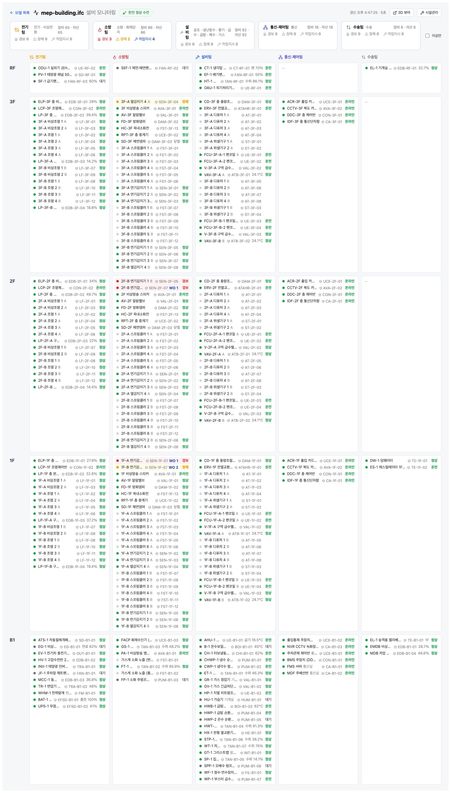
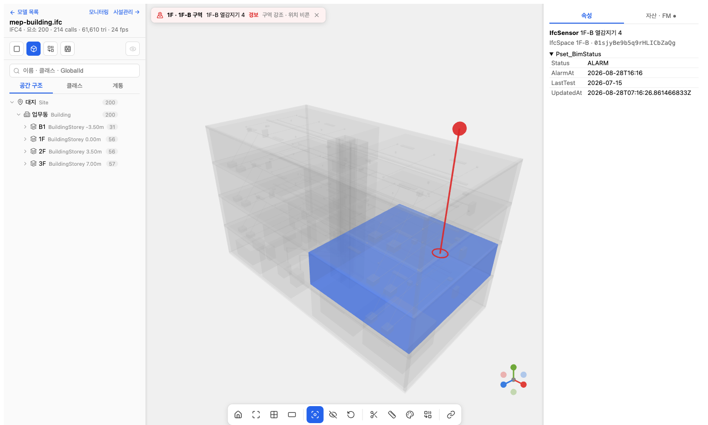
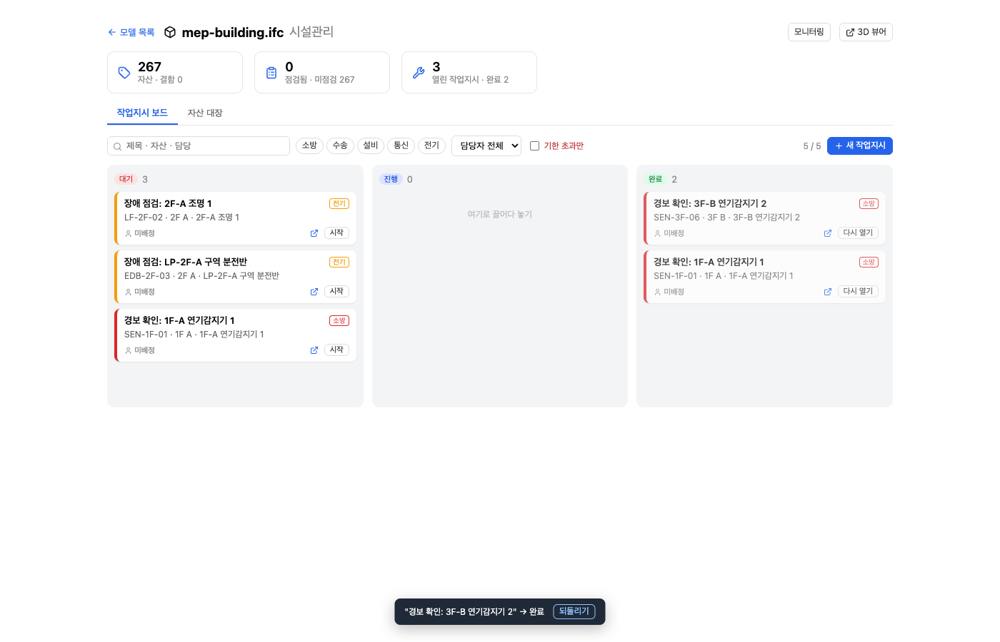
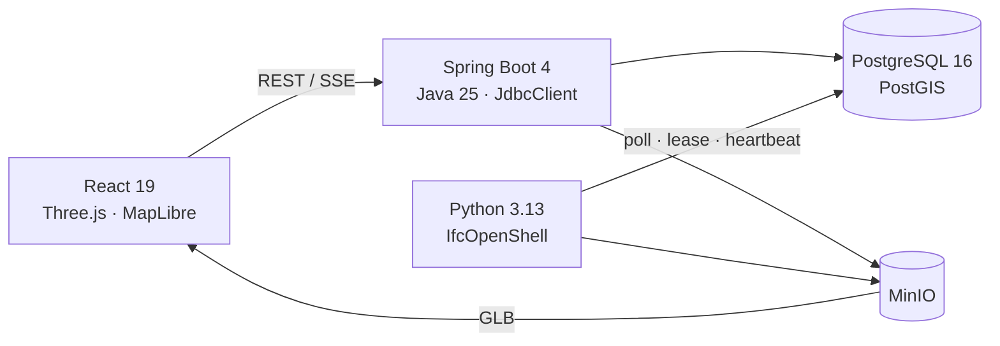

# BIM Operations Platform

> IFC 모델을 웹 3D 공간으로 전환하고, 설비 계통 추적부터 운영 모니터링·자산·점검·작업지시까지 연결한 BIM 기반 시설관리 플랫폼

**개인 프로젝트**로 제품 기획, 도메인 모델링, 백엔드·프론트엔드, IFC 변환 워커, 데이터베이스와 Docker 실행 환경을 엔드투엔드로 설계·구현했습니다.

| 3D 뷰어 · 설비 경로 추적 | 팀 × 층 설비 모니터링 |
|---|---|
|  |  |
| 경보 위치 포커스 | 작업지시 칸반 |
|  |  |

## 핵심 구현

- **IFC 변환 파이프라인** — 업로드된 IFC를 Python·IfcOpenShell 워커가 glTF로 변환하고, 요소·Pset·공간 계층·설비 계통·연결·지리참조를 PostgreSQL/PostGIS와 MinIO에 적재합니다.
- **규모 측정** — 2만 요소 합성 모델 기준 요소 목록 API 124 ms, 응답 2.5 MB → gzip 180 KB, 상태판 76 ms. 병목이 DB가 아니라 페이로드임을 확인하고 페이징은 선택 파라미터로만 두었습니다.
- **장애에 강한 DB 잡 큐** — PostgreSQL `FOR UPDATE SKIP LOCKED`로 작업을 선점하고 lease owner·heartbeat·재시도로 중복 실행과 중단된 작업을 관리합니다. 별도 메시지 브로커 없이 현재 규모에 필요한 신뢰성을 확보했습니다.
- **BIM 3D 탐색 경험** — Three.js 기반 요소 선택, 속성 조회, 공간·종류·계통 트리, 검색, 단면, 측정, 격리, 속성별 색상, 다중 선택과 뷰포인트 공유를 구현했습니다.
- **방향성 MEP 그래프** — IFC 계통과 요소 연결을 그래프로 저장하고 PostgreSQL 재귀 CTE로 상류 원천과 하류 영향 범위를 추적합니다. 같은 구조로 정전 시 일반전원·비상전원 영향 범위를 계산합니다.
- **운영 상태에서 업무로 연결** — BMS 연동을 염두에 둔 JSONB 상태 병합 API를 만들고, 경보·장애 발생 시 상위 원인 설비 억제, 열린 작업지시 재사용, 완료 후 단시간 재발 처리 규칙으로 작업지시를 생성합니다.
- **BIM과 FMS 수명주기 분리** — 자산은 IFC 요소 연결을 선택 사항으로 두어 모델에 없는 장비도 관리하고, 재변환 시 자산·점검·작업 이력을 보존하도록 설계했습니다.
- **설비 데모 건물 직접 생성** — 14계통 474요소 521연결의 업무동을 IfcOpenShell API로 생성했습니다(B2 변전·발전기·기계실, B1 주차장·방재실, 옥탑 보일러실, 계단·차량 램프·슬래브 개구부). 샘플 IFC 없이도 추적·경보·정전·주차 시나리오를 바로 돌려볼 수 있습니다.

## 아키텍처



Docker Compose는 `web`, `api`, `ifc-worker`, `postgis`, `minio` 5개 서비스를 실행합니다. 브라우저는 변환 진행률을 SSE로 받고, 변환된 GLB의 IFC GlobalId 노드를 API의 요소 데이터와 연결합니다.

## 주요 기능

| 영역 | 구현 내용 |
|---|---|
| IFC / BIM | IFC2x3·IFC4 입력, GLB 변환, Pset·공간 계층·계통·연결·지리참조 추출 |
| 3D Viewer | 요소 탐색, 속성·계통 조회, 단면·측정·격리, 색상화, 다중 선택, 뷰포인트 공유 |
| MEP | 계통별 상류·하류 추적, 순환 방지, 계통 범위 제한, 정전 영향 시나리오 |
| Monitoring | 팀 × 층 상태판, 경보 위치 강조, 최근 이벤트, 계측 임계값, 키오스크 모드 |
| FMS | 자산 대장, 점검 결과, 작업지시 자동 생성, 우선순위·담당자 기반 칸반 |
| GIS | IFC 지리참조 기반 PostGIS 풋프린트와 MapLibre 지도, 수동 위치 보정 |

## 설계 결정

| 결정 | 이유 |
|---|---|
| Java API + Python IFC 워커 | 트랜잭션 중심 API와 IfcOpenShell 기하 처리의 책임을 분리 |
| 서버에서 IFC → GLB 변환 | 브라우저의 파싱 부담을 줄이고 결과물을 캐시·배포하기 쉽게 구성 |
| PostgreSQL 잡 큐 | 소수 워커와 분 단위 변환 작업에 맞춰 운영 구성요소를 최소화 |
| 요소 간 방향 그래프 | 원천 → 말단 추적을 단순화하고 재귀 CTE로 영향 범위를 계산 |
| 운영 정보는 IFC 밖에 저장 | 설계 원본과 운영 이력을 분리해 모델 재변환에도 FMS 데이터를 보존 |
| MapLibre 2D 지도 | 건물 배치와 풋프린트 확인이라는 현재 요구에 필요한 수준으로 범위 설정 |

## 도메인 관점

- **운영은 설계보다 10배 오래 간다** — 설계·시공 1~3년, 운영 30~50년. 그래서 IFC를 고치지 않고(write-back 없음) 준공 모델 *위에* 자산·점검·작업지시·운영 상태를 쌓는 구조로 잡았습니다.
- **표준은 필요한 만큼만** — COBie Component ≈ 자산(벽·슬래브가 아니라 유지보수 대상만), Job ≈ 점검·작업지시. BCF 3.0 topic(제목·상태·담당·기한)은 작업지시와 1:1, viewpoint(카메라·선택·단면)는 뷰어 URL과 같은 필드로 저장해 정식 입출력은 변환기만 붙이면 되게 했습니다.
- **MEP는 원천→말단의 방향 그래프** — 수전반→변압기→분전반→조명, 발전기→ATS→비상분전반, 감지기→중계기→R형 수신기(신호라 수신기가 하류), 소화수조→펌프→알람밸브→헤드. 실무 관행(주차장 준비작동식 스프링클러, 옥탑 보일러로 도시가스 지하 반입 회피, 음용 저수조와 오폐수조 분리, 집수정은 수위가 높을수록 이상)을 모델과 판정 규칙에 그대로 넣었습니다.
- **현장은 계통이 아니라 팀으로 움직인다** — 전기·소방·설비·통신제어·수송 팀 기준 상태판, 요소가 여러 계통에 걸칠 때 소방 > 수송 > 설비 > 통신 > 전기 우선순위(전원은 거의 모든 장비에 걸려 맨 뒤), 경보 포커스는 줌인 대신 건물 전체 맥락 + 위치 비콘(찾아가는 사람의 관점).

## 데이터 흐름

`IFC 업로드` → `model / conversion_job 생성` → `워커 작업 선점` → `GLB 변환 및 BIM 데이터 추출` → `PostgreSQL + MinIO 저장` → `SSE 진행률 갱신` → `웹 3D 뷰어 로드`

핵심 데이터 모델은 다음과 같습니다.

```text
project ─ model ─ element ─ asset ─┬─ inspection
             │                     └─ work_order (viewpoint)
             ├─ spatial_node
             ├─ system ↔ element_system
             ├─ connection (upstream → downstream)
             └─ conversion_job
```

## 기술 스택

- **Backend:** Java 25, Spring Boot 4.1, Spring MVC, JdbcClient, Flyway
- **Data / Storage:** PostgreSQL 16, PostGIS 3.4, MinIO
- **IFC Worker:** Python 3.13, IfcOpenShell 0.8.5, psycopg, pyproj
- **Frontend:** React 19, TypeScript, Vite 8, Three.js, MapLibre GL
- **Quality / Ops:** JUnit 5, Testcontainers, Python unittest, Docker Compose, nginx

## 실행 방법

필수 환경: Docker와 Docker Compose

```bash
cp .env.example .env
docker compose up -d --build --wait
```

웹 화면: [http://localhost:5173](http://localhost:5173)

`.env.example`의 값은 로컬 데모용입니다. 외부 환경에 배포할 때는 반드시 자격증명을 변경하고 인증 계층을 추가해야 합니다. 현재 애플리케이션에는 사용자 인증·권한 관리가 구현되어 있지 않아 공개 서비스 용도가 아닌 **단일 사용자 데모**를 전제로 합니다.

샘플 IFC 준비 방법은 [`samples/README.md`](samples/README.md)에 있습니다. 설비 데모 모델은 다음 명령으로 생성할 수 있습니다.

```bash
docker compose cp samples/gen/gen_mep.py ifc-worker:/tmp/
docker compose exec ifc-worker sh -c 'cd /tmp && python gen_mep.py mep-building.ifc'
docker compose cp ifc-worker:/tmp/mep-building.ifc samples/
```

업로드 후 BMS 이벤트 시뮬레이터는 모델 ID를 인자로 실행합니다.

```bash
python3 samples/gen/bms_sim.py <modelId>
```

## 개발 및 테스트

```bash
# API 통합 테스트 (Docker 필요: Testcontainers가 PostGIS 실행)
cd api && ./gradlew test

# IFC 워커 단위 테스트 (외부 서비스 없이 실행 가능)
cd ifc-worker && python3 -m unittest discover -s tests

# 프론트엔드 정적 검사와 프로덕션 빌드
cd web && npm ci && npm run lint && npm run build
```

주요 화면 경로:

- `#/` — 프로젝트·모델 목록과 IFC 업로드
- `#/models/{id}` — 3D 뷰어
- `#/models/{id}/monitor` — 설비 모니터링 (`?kiosk=1` 벽면 모드)
- `#/models/{id}/fm` — 자산·점검·작업지시
- `#/map` — GIS 지도

## 저장소 구조

```text
api/          Spring Boot API, DB migration, Testcontainers 통합 테스트
ifc-worker/   IFC 변환·추출 워커와 lease/retry 테스트
web/          React UI, Three.js 뷰어, 모니터링·FMS·지도
samples/      공개 IFC 안내, MEP 모델 생성기, BMS 시뮬레이터
images/       주요 기능 스크린샷
compose.yaml  로컬 실행 환경
```

## 현재 범위와 다음 단계

- 실무 IFC의 `IfcDistributionPort` / `IfcRelConnectsPorts` 변환 지원
- 인증·권한 관리와 외부 공개 배포 구성
- IDS 검증, COBie·BCF 파일 입출력
- 대규모 모델을 위한 3D Tiles 및 추가 성능 검증
- CI에서 빌드·테스트·컨테이너 보안 검사 자동화
