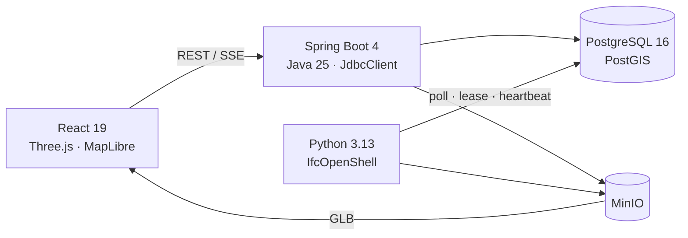

# BIM Operations Platform

> IFC 모델을 웹 3D 공간으로 전환하고, 설비 계통 추적부터 운영 모니터링·자산·점검·작업지시까지 연결한 BIM 기반 시설관리 데모 웹 앱

FMS·MEP 분야의 실무 경험을 바탕으로 업무 흐름과 기술 구현을 보여주기 위해 만든 **포트폴리오용 개인 프로젝트**이며, 실제 운영·상용 서비스가 아닙니다. 제품 기획과 도메인 모델링부터 백엔드·프론트엔드, IFC 변환 워커, 데이터베이스, Docker 실행 환경까지 엔드투엔드로 설계·구현했습니다.

| 3D 뷰어 · 설비 경로 추적 | 팀 × 층 설비 모니터링 |
|---|---|
|  |  |
| 경보 위치 포커스 | 작업지시 칸반 |
|  |  |

## 핵심 구현

- **IFC 변환 파이프라인** — Python·IfcOpenShell 워커가 IFC를 glTF로 변환하고 요소, Pset, 공간 계층, 설비 계통, 연결, 지리참조를 PostgreSQL/PostGIS와 MinIO에 적재합니다.
- **장애에 강한 DB 잡 큐** — PostgreSQL `FOR UPDATE SKIP LOCKED`와 lease owner, heartbeat, 재시도로 중복 실행과 중단 작업을 관리해 별도 메시지 브로커 없이 변환 신뢰성을 확보했습니다.
- **방향성 MEP 그래프** — IFC 계통과 요소 연결을 저장하고 재귀 CTE로 상류 원천과 하류 영향 범위를 추적합니다. 같은 구조로 일반·비상전원의 정전 영향도 계산합니다.
- **운영 상태에서 업무로 연결** — JSONB 상태 병합 API와 함께 상위 원인 설비 경보 억제, 열린 작업지시 재사용, 완료 직후 재발 처리 규칙을 구현했습니다.
- **BIM 3D 탐색 경험** — Three.js 기반 요소 선택·검색, 속성·계통 트리, 단면, 측정, 격리, 색상화, 다중 선택과 뷰포인트 공유를 구현했습니다.
- **BIM과 FMS 수명주기 분리** — IFC 연결이 없는 자산도 관리하며, 모델을 재변환해도 자산·점검·작업 이력이 보존되도록 운영 데이터를 분리했습니다.

## 아키텍처



Docker Compose는 `web`, `api`, `ifc-worker`, `postgis`, `minio`를 실행합니다. 브라우저는 SSE로 변환 진행률을 받고, GLB의 IFC GlobalId 노드를 API의 요소 데이터와 연결합니다.

```text
project ─ model ─ element ─ asset ─┬─ inspection
             │                     └─ work_order (viewpoint)
             ├─ spatial_node
             ├─ system ↔ element_system
             ├─ connection (upstream → downstream)
             └─ conversion_job
```

## 설계 결정

| 결정 | 이유 |
|---|---|
| Java API + Python IFC 워커 | 트랜잭션 중심 API와 IfcOpenShell 기하 처리의 책임 분리 |
| 서버에서 IFC → GLB 변환 | 브라우저 파싱 부담을 줄이고 결과물을 캐시·배포하기 쉽게 구성 |
| PostgreSQL 잡 큐 | 소수 워커와 분 단위 작업에 맞춰 운영 구성요소 최소화 |
| 요소 간 방향 그래프 | 원천 → 말단 추적과 재귀 CTE 기반 영향 범위 계산 |
| 운영 정보는 IFC 밖에 저장 | 설계 원본과 운영 이력을 분리해 재변환에도 FMS 데이터 보존 |

## 도메인 관점

- **긴 운영 수명주기를 고려한 구조** — 준공 IFC를 직접 수정하지 않고 그 위에 자산·점검·작업지시·운영 상태를 쌓습니다.
- **표준 확장을 고려한 데이터 모델** — COBie의 자산·작업 개념과 BCF topic·viewpoint의 주요 필드를 대응시켜 향후 표준 입출력을 확장할 수 있게 설계했습니다.
- **현장 중심의 계통 해석** — 전기·소방·설비·통신제어·수송 팀 기준 상태판과 원천 → 말단 그래프를 결합해 경보 위치뿐 아니라 원인과 영향 범위를 함께 보여줍니다.

## 기술 스택

- **Backend:** Java 25, Spring Boot 4.1, Spring MVC, JdbcClient, Flyway
- **Data / Storage:** PostgreSQL 16, PostGIS 3.4, MinIO
- **IFC Worker:** Python 3.13, IfcOpenShell 0.8.5, psycopg, pyproj
- **Frontend:** React 19, TypeScript, Vite 8, Three.js, MapLibre GL
- **Quality / Ops:** JUnit 5, Testcontainers, Python unittest, Docker Compose, nginx

## 빠른 실행

```bash
cp .env.example .env
docker compose up -d --build --wait
```

웹 화면: [http://localhost:5173](http://localhost:5173)

> `.env.example`은 로컬 데모용입니다. 현재 사용자 인증·권한 관리가 구현되어 있지 않으므로 외부 공개가 아닌 **단일 사용자 데모**를 전제로 합니다.

<details>
<summary>샘플 IFC 생성과 BMS 이벤트 시뮬레이션</summary>

샘플 안내는 [`samples/README.md`](samples/README.md)에서 확인할 수 있습니다.

```bash
docker compose cp samples/gen/gen_mep.py ifc-worker:/tmp/
docker compose exec ifc-worker sh -c 'cd /tmp && python gen_mep.py mep-building.ifc'
docker compose cp ifc-worker:/tmp/mep-building.ifc samples/
python3 samples/gen/bms_sim.py <modelId>
```
</details>

<details>
<summary>개발·테스트 명령과 주요 화면 경로</summary>

```bash
(cd api && ./gradlew test)
(cd ifc-worker && python3 -m unittest discover -s tests)
(cd web && npm ci && npm run lint && npm run build)
```

- `#/` — 모델 목록과 IFC 업로드
- `#/models/{id}` — 3D 뷰어
- `#/models/{id}/monitor` — 설비 모니터링 (`?kiosk=1` 벽면 모드)
- `#/models/{id}/fm` — 자산·점검·작업지시
- `#/map` — GIS 지도
</details>

<details>
<summary>저장소 구조</summary>

```text
api/          Spring Boot API, DB migration, 통합 테스트
ifc-worker/   IFC 변환·추출 워커와 lease/retry 테스트
web/          React UI, Three.js 뷰어, 모니터링·FMS·지도
samples/      IFC 안내, MEP 모델 생성기, BMS 시뮬레이터
images/       주요 기능 스크린샷
compose.yaml  로컬 실행 환경
```
</details>

## 현재 범위와 다음 단계

- 실무 IFC의 `IfcDistributionPort` / `IfcRelConnectsPorts` 변환으로 지원 범위 확대
- 인증·권한 관리와 외부 공개 배포 구성
- 대규모 모델을 위한 3D Tiles와 확장성 검증
