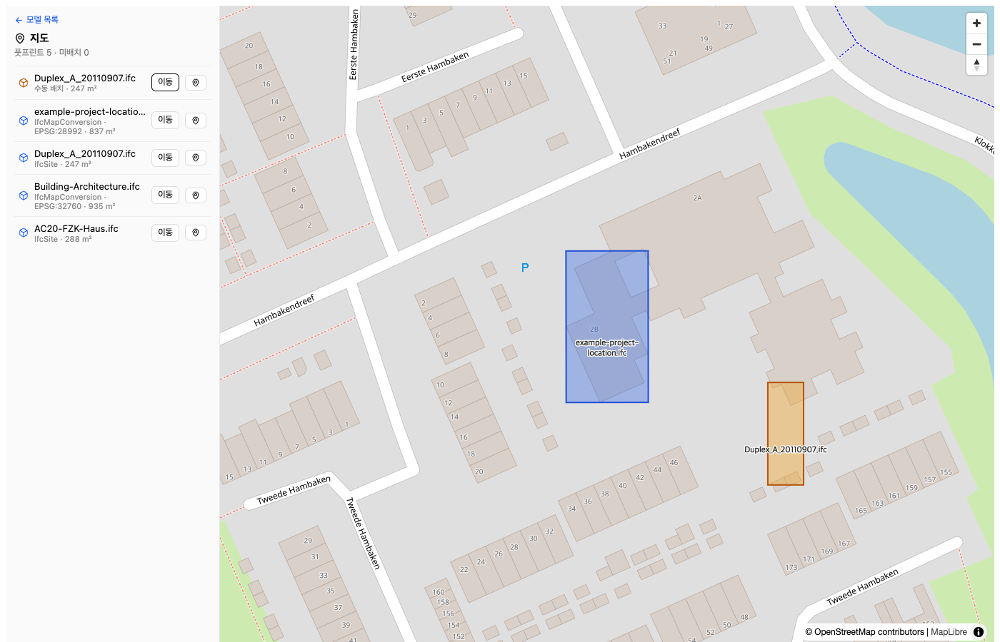
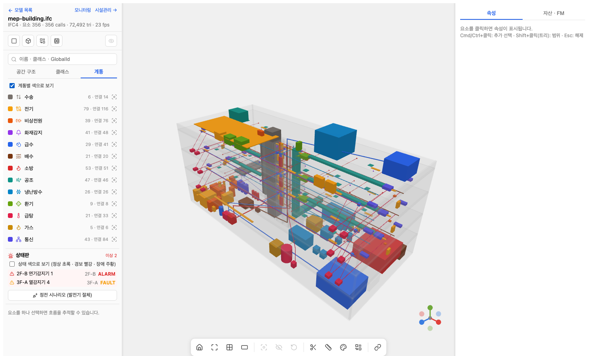
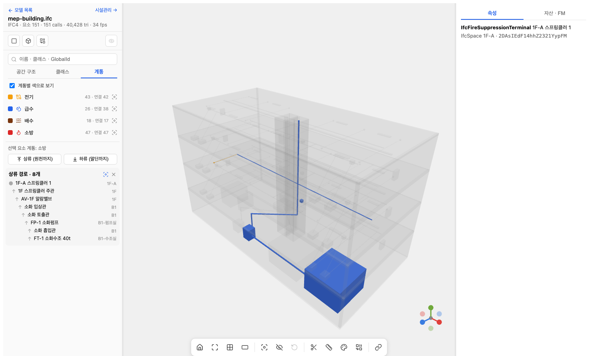
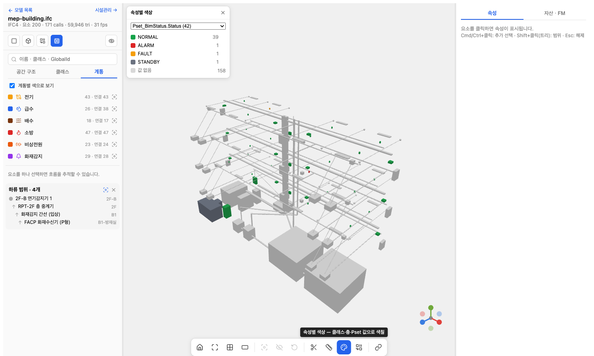
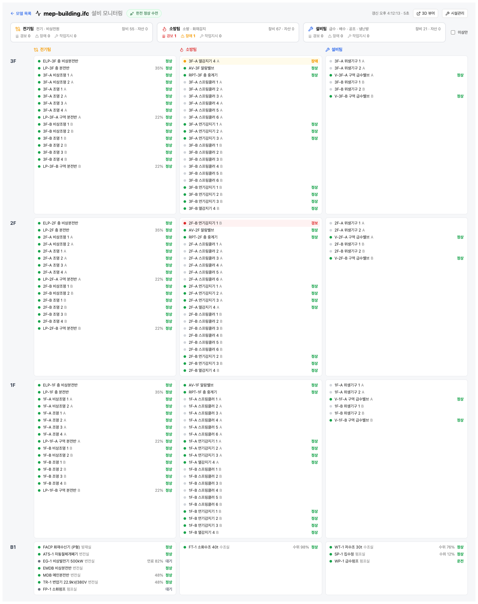
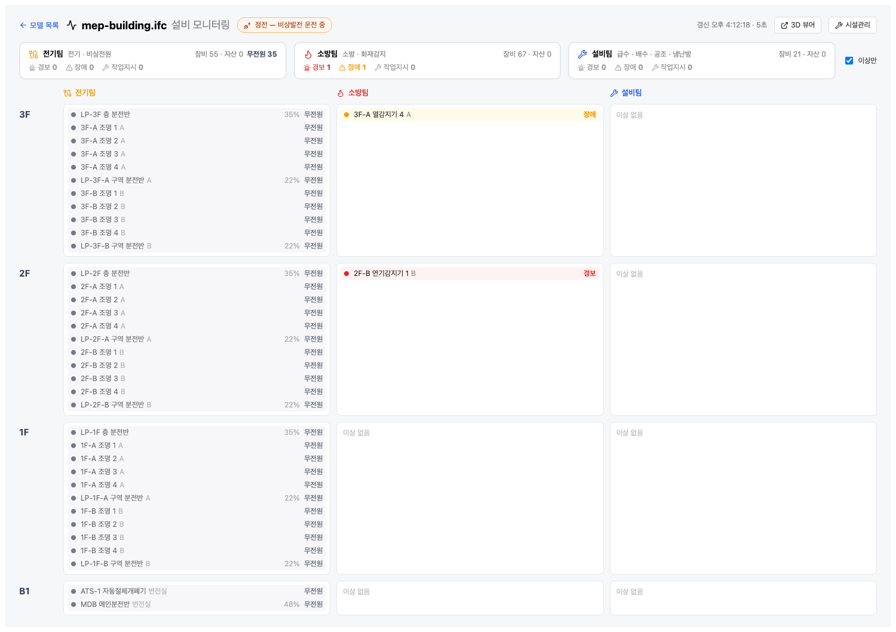
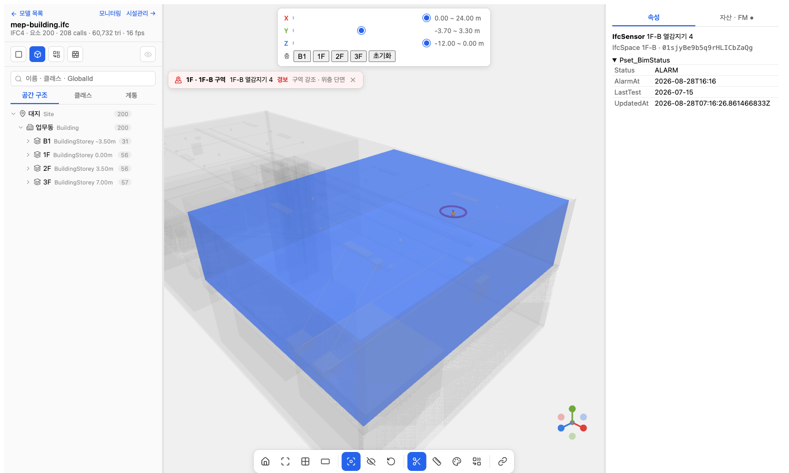
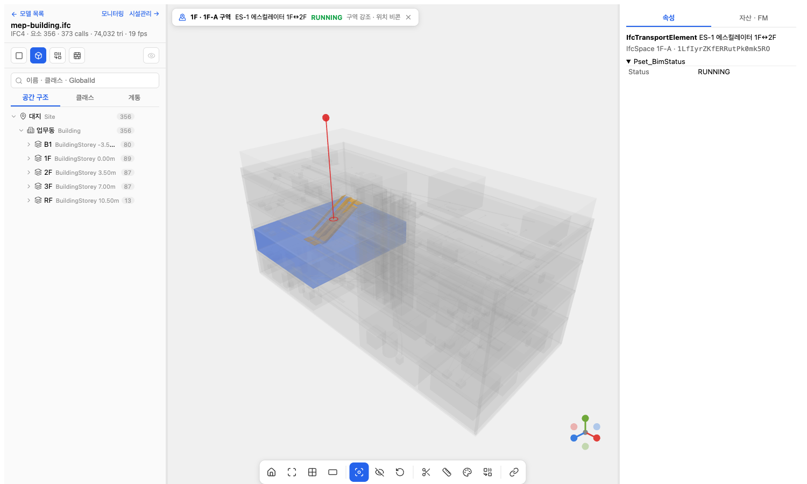

# bim-platform

IFC 모델을 업로드하면 서버에서 변환하고, 웹에서 3D로 보고, 지도 위에 배치하고, 시설관리(FMS) 자산·점검·작업지시로 연결하는 **개인 BIM 미니 플랫폼**.

> 상태 (2026-08-28): M0 골격 · M1 변환 · M2 뷰어 · M3 지도 · M4 FMS · M6 설비 계통 완료, 이후 정비(변환 잡 lease, 서비스 분리, 규모 측정·보안) 완료. M5(IDS·COBie·3D Tiles·CI)는 보류. `docs/` 부터 읽으세요.

## 무엇을 보여주려는가

- **BIM 데이터 파이프라인**: IFC → IfcOpenShell 변환 → glTF + 속성 DB (서버 사이드, 대용량 대응)
- **플랫폼 백엔드**: Java 25 / Spring Boot 4 MVC (가상 스레드), PostgreSQL + PostGIS, MinIO
- **3D 웹 뷰어**: React + Three.js, 요소 선택·속성·공간 계층
- **GIS 통합**: IFC 지리참조 → PostGIS 풋프린트 → MapLibre 지도
- **FMS 통합**: 요소 → 자산 → 점검 → 작업지시 칸반 (COBie / BCF 개념 반영)
- **설비 계통**: 연결 그래프 추적(상류/하류), 운영 상태·경보 → 작업지시 자동, 팀×층 모니터링, 정전 시나리오
- **전부 Docker Compose** 한 번으로 기동

## 문서

| 순서 | 파일 | 내용 |
|---|---|---|
| 1 | [docs/00-overview.md](docs/00-overview.md) | 목적, 요구사항, 결정 요약 |
| 2 | [docs/01-architecture.md](docs/01-architecture.md) | 컨테이너 구성, 데이터 흐름, API 개요 |
| 3 | [docs/02-data-model.md](docs/02-data-model.md) | 테이블/ERD |
| 4 | [docs/03-tech-radar.md](docs/03-tech-radar.md) | BIM 오픈소스 조사표 (2026-08) |
| 5 | [docs/04-milestones.md](docs/04-milestones.md) | 마일스톤별 범위와 학습 주제 |
| 6 | [docs/05-scale-and-security.md](docs/05-scale-and-security.md) | 2만 요소 측정 결과, 외부 배포 보안 조치 |
| — | [docs/adr/](docs/adr/) | 아키텍처 결정 기록 |
| — | [docs/study/](docs/study/) | 개발하며 남기는 학습 노트 |

## 실행

```bash
cp .env.example .env            # 자격증명(로컬 기본값 bim / minio123). 외부 배포 전 변경 — docs/05-scale-and-security.md
docker compose up -d --build --wait
# web   → http://localhost:5173
# api   → http://localhost:8080/actuator/health   (api·postgis·minio 는 127.0.0.1 바인딩 — 외부엔 web 만)
# minio → http://localhost:9001  (.env 의 MINIO_ROOT_USER / PASSWORD)
# db    → localhost:5432  bim / bim / bim
docker compose down -v   # 볼륨까지 초기화
```

### 업로드 확인 (M1)


`http://localhost:5173` 에서 IFC 선택 → 진행률(SSE) → READY 면 glb 링크, FAILED 면 에러 + 재시도.

```bash
PID=$(curl -s -X POST localhost:8080/api/projects -H 'content-type: application/json' -d '{"name":"demo"}' | jq -r .id)
curl -F file=@samples/Duplex_A_20110907.ifc localhost:8080/api/projects/$PID/models   # 202, {id,...}
curl localhost:8080/api/models/<id>                                                   # status, jobStatus, progress, error
curl -N localhost:8080/api/models/<id>/events                                         # SSE, READY/FAILED 에서 종료
curl -X POST localhost:8080/api/models/<id>/retry                                     # FAILED 만 재등록
```

### 3D 뷰어 (M2)


모델 목록에서 READY 모델 클릭 → `#/models/{id}`. 요소 클릭 → Pset, 층/클래스 필터, 검색, 표시 옵션(Opening·Space·재질별 병합 + draw call 카운터), 섹션 박스(X/Y/Z, 층 스냅), 측정, 격리/숨김, 호버 툴팁, 뷰 프리셋·더블클릭 핏, 뷰포인트 URL 공유. 리사이즈 패널, 하단 아이콘 툴바, XYZ 축 기즈모, 트리 숨김/솔로, 다중 선택(Cmd·Shift), 우클릭 메뉴, 속성별 색상(클래스·층·Pset 값).

### 지도 (M3)



`#/map` — worker 가 IfcMapConversion(EPSG·회전·단위) 또는 IfcSite 위경도에서 풋프린트를 뽑아 PostGIS 에 저장, MapLibre 에 표시. 지리참조 없는 모델은 지도 클릭으로 배치(수동 핀 + 회전).

### 시설관리 (M4)


뷰어에서 요소 선택 → "자산 · FM" 탭 → 자산 등록(IFC Pset 스냅샷) → 점검 OK/결함 → 작업지시(현재 뷰포인트 저장). `#/models/{id}/fm` 보드는 지라형 칸반(대기·진행·완료 드래그, 낙관적 이동 + 되돌리기, 팀·담당·기한초과 필터, 우선순위, 드로어 편집). 카드의 "3D" 를 누르면 뷰어가 그 위치·선택으로 돌아간다.

### 설비 계통 (M6)











`samples/mep-building.ifc` — `samples/gen/gen_mep.py` 로 만든 가상 업무동 36×16m. **층 구성은 실무 관행대로**: B2 변전실·발전기실(연료탱크)·펌프실·기계실·수조실·오폐수처리실 + 주차 / B1 주차장(EV 충전) + 방재실·통신실·주차관제실 / 지상 3층 A·B 구역 / 옥탑 보일러실(가스는 지상 위로만)·옥상 장비. 계단실 2개소 전 층, 차량 램프 17%(옥외 지상→B1, 건물 내 B1→B2), 슬래브 개구부(샤프트·계단·램프·에스컬레이터·덤웨이터). **14계통 474요소 521연결**: 전기(수변전 500kVA·MCC·태양광·EV)·비상전원(발전기 200kW·ATS·UPS)·화재감지(수신기·중계기·감지기·방송)·급수·급탕·배수·소방(펌프·알람밸브·스프링클러·소화전·가스계, 주차장 준비작동식)·공조(AHU·OAU·VAV·디퓨저·댐퍼)·냉난방수(냉동기·냉각탑·보일러·히트펌프·열교환기·FCU)·환기(급배기·제연·제트팬·ERV·CO센서)·가스·통신(MDF/IDF·BMS·DDC·CCTV·출입)·**주차관제**(수송팀: PCS 서버 → 입·출구 차단기·LPR 카메라·무인정산기·만공차 표시판·주차면 센서 14 — 센서 `Occupied` 를 바꾸면 PCS 점유수·만공차 표시판이 서버에서 집계됨, 출구 차단기 FAULT 예시)·수송(EL/ES/DW — 에스컬레이터 1F 로비↔2F, 30° 경사 트러스). 장비 195개에 운영 상태(`Pset_BimStatus`). 뷰어 "계통" 탭에서 계통별 색, 요소 선택 → **상류(원천까지) / 하류(말단까지)** 추적, **상태판**(경보/장애 목록, API 로 상태 갱신 → 수신기 집계·작업지시 자동), **정전 시나리오**(발전기 절체 시 전원 있음/없음을 흐름 그래프로 계산). `#/models/{id}/monitor` **모니터링**: 팀(전기·소방·설비·통신제어·수송) × 층 격자에 장비 상태·자산·작업지시, 5초 갱신. `python3 samples/gen/bms_sim.py <modelId>` 로 BMS 시뮬레이션(경보·장애·펌프·수위·정전).

샘플 IFC 는 `samples/README.md` 참고(`.ifc` 는 git 에 없음 — 다운로드 또는 `gen_mep.py` 로 생성).

## 개발

- api: `cd api && ./gradlew test` (Testcontainers, Docker 필요) · worker: `cd ifc-worker && pytest` · web: `cd web && npm run dev`
- 코드 수정 후 컨테이너 반영: `docker compose up -d --build api ifc-worker web` (이미지 빌드형, 볼륨 마운트 아님)
- 자동 UI 테스트는 없고 헤드리스 Chrome 으로 수동 검증 — [01-architecture](docs/01-architecture.md#테스트)
