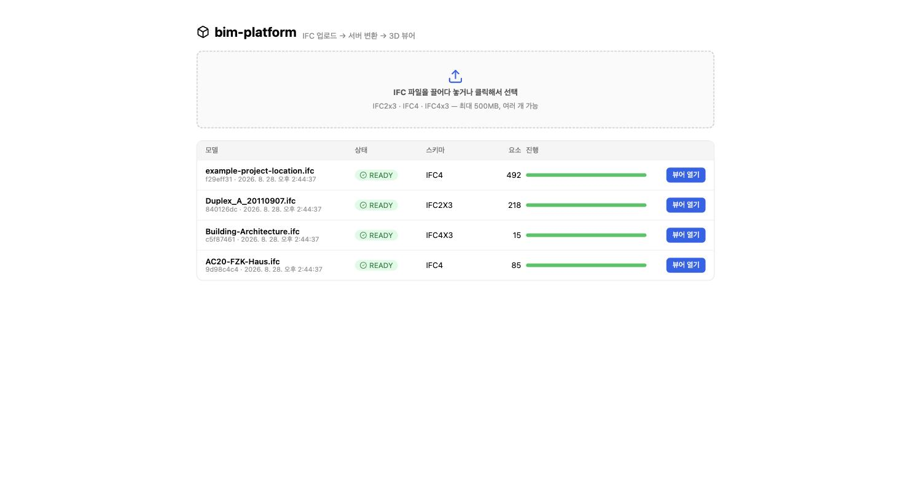
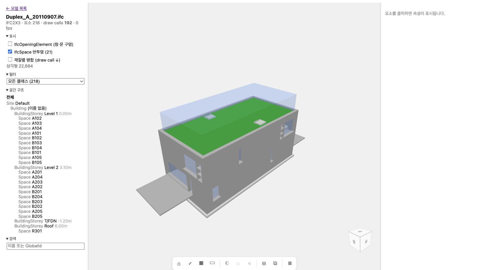

# bim-platform

IFC 모델을 업로드하면 서버에서 변환하고, 웹에서 3D로 보고, 지도 위에 배치하고, 시설관리(FMS) 자산·점검·작업지시로 연결하는 **개인 BIM 미니 플랫폼**.

> 상태: M0 골격 완료 (2026-08-28). `docs/` 부터 읽으세요.

## 무엇을 보여주려는가

- **BIM 데이터 파이프라인**: IFC → IfcOpenShell 변환 → glTF + 속성 DB (서버 사이드, 대용량 대응)
- **플랫폼 백엔드**: Java 25 / Spring Boot 4 MVC (가상 스레드), PostgreSQL + PostGIS, MinIO
- **3D 웹 뷰어**: React + Three.js, 요소 선택·속성·공간 계층
- **GIS 통합**: IFC 지리참조 → PostGIS 풋프린트 → MapLibre 지도
- **FMS 통합**: 요소 → 자산 → 점검 → 작업지시 (COBie / BCF 개념 반영)
- **전부 Docker Compose** 한 번으로 기동

## 문서

| 순서 | 파일 | 내용 |
|---|---|---|
| 1 | [docs/00-overview.md](docs/00-overview.md) | 목적, 요구사항, 결정 요약 |
| 2 | [docs/01-architecture.md](docs/01-architecture.md) | 컨테이너 구성, 데이터 흐름, API 개요 |
| 3 | [docs/02-data-model.md](docs/02-data-model.md) | 테이블/ERD |
| 4 | [docs/03-tech-radar.md](docs/03-tech-radar.md) | BIM 오픈소스 조사표 (2026-08) |
| 5 | [docs/04-milestones.md](docs/04-milestones.md) | 마일스톤별 범위와 학습 주제 |
| — | [docs/adr/](docs/adr/) | 아키텍처 결정 기록 |
| — | [docs/study/](docs/study/) | 개발하며 남기는 학습 노트 |

## 실행

```bash
docker compose up -d --build --wait
# web   → http://localhost:5173
# api   → http://localhost:8080/actuator/health
# minio → http://localhost:9001  (minio / minio123)
# db    → localhost:5432  bim / bim / bim
docker compose down -v   # 볼륨까지 초기화
```

### 업로드 확인 (M1)



`http://localhost:5173` 에서 IFC 선택 → 진행률(SSE) → READY 면 glb 링크, FAILED 면 에러 + 재시도.

```bash
PID=$(curl -s -X POST localhost:8080/api/projects -H 'content-type: application/json' -d '{"name":"demo"}' | jq -r .id)
curl -F file=@samples/Duplex_A_20110907.ifc localhost:8080/api/projects/$PID/models   # 202, {id,...}
curl localhost:8080/api/models/<id>                                                   # status, jobStatus, progress, error
curl -N localhost:8080/api/models/<id>/events                                         # SSE, READY/FAILED 에서 종료
curl -X POST localhost:8080/api/models/<id>/retry                                     # FAILED 만 재등록
```

### 3D 뷰어 (M2)



모델 목록에서 READY 모델 클릭 → `#/models/{id}`. 요소 클릭 → Pset, 층/클래스 필터, 검색, 표시 옵션(Opening·Space·재질별 병합 + draw call 카운터).

샘플 IFC 는 `samples/README.md` 참고. 로컬 개발: `cd api && ./gradlew test` (Testcontainers, Docker 필요), `cd web && npm run dev`.
