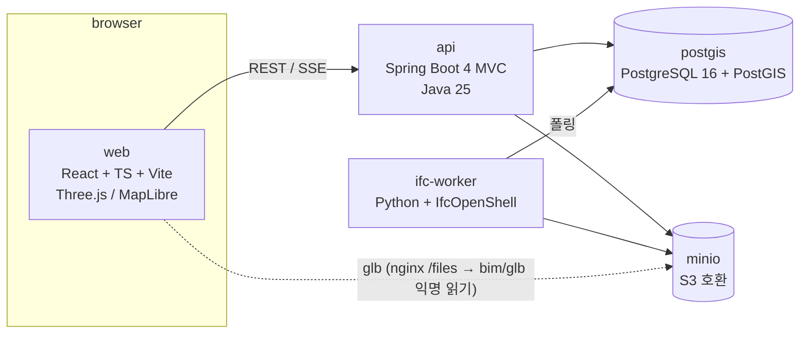

# 01. 아키텍처

## 컨테이너 구성 (docker compose)



| 서비스 | 이미지 | 역할 |
|---|---|---|
| `web` | node 빌드 → nginx 정적 서빙 | UI. API 프록시(`/api`, gzip·레이트리밋), MinIO 프록시(`/files/bim/glb/` 만). **외부에 노출되는 유일한 컨테이너** — 나머지는 `127.0.0.1` 바인딩 ([05](05-scale-and-security.md)) |
| `api` | eclipse-temurin:25 | 모델/요소/공간/지도/FMS API, SSE 진행상태, 잡 등록 |
| `ifc-worker` | python:3.13-slim + IfcOpenShell 0.8.5 (pip) | IFC → glb, 요소/속성/공간계층/지리참조 추출, (M5) IDS 검증 |
| `postgis` | postgis/postgis:16-3.4 | 메타데이터, 요소 속성(jsonb), 공간 데이터, 잡 큐 |
| `minio` | minio/minio | IFC 원본, glb, 썸네일 |

컨테이너 5개. Redis·메시지 브로커·별도 nginx 없음 — [ADR 0003](adr/0003-db-table-queue.md).

## 데이터 흐름: 업로드 → 뷰어

```mermaid
sequenceDiagram
  participant W as web
  participant A as api
  participant S as minio
  participant P as postgis
  participant K as ifc-worker
  W->>A: POST /api/projects/{pid}/models (multipart IFC)
  A->>S: put models/{modelId}/source.ifc
  A->>P: insert model(UPLOADED), conversion_job(PENDING)
  A-->>W: 202 {id, status}
  W->>A: GET /api/models/{id}/events (SSE)
  K->>P: SELECT job FOR UPDATE SKIP LOCKED → RUNNING (lease_owner, heartbeat 30s)
  K->>S: get source.ifc
  K->>K: IfcOpenShell: geom → glb, 요소/Pset/공간계층/지리참조 추출
  K->>S: put glb/{modelId}.glb
  K->>P: bulk insert element, spatial_node; update model(READY, footprint)
  K->>P: job DONE (progress 0→100 중간 갱신)
  A-->>W: SSE progress / READY
  W->>S: GET /files/bim/glb/{id}.glb (nginx → bim/glb/ 만 프록시, 익명 읽기)
```

진행률은 worker가 `conversion_job.progress`를 갱신하고 api가 1초 간격 폴링해 SSE로 내보낸다. LISTEN/NOTIFY는 필요해지면 교체.

## 모듈 경계

### api (Gradle 단일 모듈, 패키지로 분리)

```
com.bim.api  (실제는 단일 패키지 — 파일 = 관심사)
  ProjectController / ModelController   프로젝트, 업로드(S3 put → DB insert, 실패 시 객체 삭제), 상태, SSE, 재시도
  ElementController                     공간 트리, 요소 검색(limit/offset 선택), 속성 키/값, 요소 상세
  MapController                         풋프린트 GeoJSON, 수동 핀
  SystemController                      계통·멤버, 재귀 CTE 경로 추적
  FmController → FmService              자산·점검·작업지시. 컨트롤러는 HTTP 어댑터, 서비스가 SQL·검증·409
  StatusController → StatusService      Pset_BimStatus 병합(트랜잭션), 작업지시 자동 생성·억제 3규칙, 정전 시나리오
  MonitorController                     팀×층 집계
  ApiErrors / Json / S3Config           DB 제약→400, jsonb 파싱, S3 클라이언트(자격증명은 env)
```

컨트롤러↔서비스 분리는 **트랜잭션·규칙이 있는 두 곳(FM·Status)만**. 나머지는 SQL 한 줄짜리라 컨트롤러에 둔다. 멀티모듈은 안 한다.

### ifc-worker (Python 단일 패키지)

```
worker/
  main.py        폴링 루프
  convert.py     ifcopenshell.geom iterator + serializers.gltf → glb (ADR 0005)
  extract.py     요소·Pset·공간계층·계통(IfcSystem)·흐름 연결(IfcRelConnectsElements) → rows
  georef.py      IfcMapConversion(단위 스케일·회전·EPSG, pyproj) / IfcSite RefLat·RefLong(DMS) → 4326. 풋프린트 = 기하 XY bbox
tests/           pytest — lease 회수, 재시도 정합성
```
(M5 IDS 검증 `ids.py` 는 아직 없음)

### web (Vite + React + TS)

```
src/
  main.tsx / App.tsx  해시 라우팅: #/ 목록·업로드(SSE) · #/models/{id} 뷰어 · /fm 시설관리 · /monitor 모니터링 · #/map 지도. 페이지는 React.lazy 분할
  api.ts         fetch 래퍼(api/post), 공용 타입(Model·Asset·WorkOrder·System…)
  ifcNames.ts    IFC 클래스 한글 라벨(클래스 탭·자산 분류·검색)
  teams.ts       팀 ↔ 계통 매핑 한 곳(순서 = 표시·우선순위). 모니터 격자, FM 보드 색, 뷰어 계통 탭 묶음이 공유
  FmPage.tsx     시설관리 페이지(탭: 작업지시 보드 · 자산 대장)
  FmBoard.tsx    지라형 칸반(드래그 낙관적 이동·되돌리기, 팀/담당/기한 필터, 드로어 편집, 생성 모달) → 뷰어(?wo=&v=&sel=&clip=)
  MonitorPage.tsx #/models/{id}/monitor 팀 5개(teams.ts) × 층 격자 상태판, KPI, 전원 배지, 5초 폴링
  MapPage.tsx    #/map MapLibre + OSM 타일, 풋프린트 레이어(자동/수동 색 구분), 클릭 팝업, 미배치 모델 지도 클릭 배치
  viewer/   scene.ts (Three.js 씬·분류·필터·병합·픽킹·섹션박스·측정·뷰포인트·기즈모) + Viewer.tsx (레이아웃·툴바·속성) + LeftPanel.tsx (트리 탭·눈/솔로 토글·검색) + ColorPanel.tsx (속성별 색상 범례) + ContextMenu.tsx (우클릭 메뉴) + FmPanel.tsx (자산 등록·점검·작업지시) + SystemPanel.tsx (계통 목록·색·상류/하류 추적) + StatusEditor.tsx (속성 탭 상단 '운영 상태': Status 버튼·Pset_BimStatus 필드 인라인 편집, PATCH 공용 함수는 상태판도 사용)
            뷰포인트 URL: #/models/{id}?v=px,py,pz,tx,ty,tz&sel={GlobalId}&clip=xmin,xmax,ymin,ymax,zmin,zmax&focus=1&wo={id} — M4 work_order.viewpoint 와 같은 필드. focus 는 건물 전체 뷰 + 구역 강조 + 비콘(길찾기용)
```

## API 개요 (v1)

| Method | Path | 설명 |
|---|---|---|
| POST | `/api/projects` | 프로젝트 생성 (이름, 위치 선택) |
| GET | `/api/projects` | 목록 + 위치 GeoJSON |
| POST | `/api/projects/{pid}/models` | IFC 업로드 |
| GET | `/api/models/{id}` | 상태, glb URL, 스키마, 풋프린트 |
| GET | `/api/models/{id}/events` | SSE 진행 상태 |
| POST | `/api/models/{id}/retry` | FAILED 모델 잡 재등록 |
| DELETE | `/api/models/{id}` | 모델 삭제 — DB CASCADE(요소·자산·작업지시·잡) + S3 source.ifc/glb. 목록 페이지 휴지통 버튼(confirm) |
| GET | `/api/models/{id}/spatial` | 공간 계층 트리 |
| GET | `/api/models/{id}/elements?ifcClass=&storey=&q=&limit=&offset=` | 요소 검색 (속성 제외, 가벼운 목록). limit/offset 선택, 기본 전체 |
| GET | `/api/models/{id}/property-keys` · `/property-values?key=Pset.Prop` | 뷰어 색상 모드: 키 목록(상위 200)·키별 값 |
| GET | `/api/models/{id}/elements/{globalId}` | 요소 + Pset. GlobalId 는 모델 안에서만 유일(같은 파일 재업로드 시 중복)이라 모델 스코프 |
| PUT | `/api/models/{id}/footprint` | 수동 핀 {lon,lat,rotation} → 로컬 bbox 폭의 사각 풋프린트(aeqd 투영) |
| GET | `/api/map/footprints?bbox=` | 지도용 GeoJSON FeatureCollection (출처·CRS·면적 포함) |
| POST | `/api/models/{id}/assets/bulk` | 계통 장비 일괄 자산 등록 (배관·트레이 제외, 태그 자동) |
| GET/POST | `/api/models/{id}/assets` | 자산 목록(연결 요소·최근 점검·열린 작업지시 수) / 등록(globalId 선택, tag 중복 409) |
| GET/PATCH/DELETE | `/api/assets/{id}` | 자산 상세(점검·작업지시 포함) / 상태·분류 변경 / 삭제(점검·작업지시 CASCADE) |
| POST | `/api/assets/{id}/inspections` | 점검 기록 OK·DEFECT |
| GET | `/api/models/{id}/work-orders?status=` | 작업지시 보드 |
| POST | `/api/assets/{id}/work-orders` | 작업지시 생성 (viewpoint jsonb = 뷰어 URL 과 같은 필드) |
| GET/PATCH | `/api/work-orders/{id}` | 상세 / 상태·담당·기한 변경 |
| GET | `/api/models/{id}/systems` · `/systems/{sid}/elements` | 설비 계통 목록·멤버 |
| GET | `/api/models/{id}/elements/{globalId}/route?dir=up\|down&scope=system\|all` | 흐름 추적 (재귀 CTE, 원천까지 / 말단까지). 기본은 출발 요소의 계통 안으로 제한 |
| GET/PATCH | `/api/models/{id}/status` · `/elements/{globalId}/status` | 런타임 상태(Pset_BimStatus jsonb 병합 — 키 하나씩 보내도 됨. 파생값은 서버 집계: 수신기 ActiveAlarms/Faults ← 감지기, 주차관제 PCS Capacity/Occupied·표시판 Text ← 주차면 센서 Occupied. 자산이면 작업지시 자동) |
| POST | `/api/models/{id}/status/sync` | 이미 ALARM/FAULT 인데 열린 작업지시가 없는 자산 요소에 작업지시 생성(규칙 동일). 자산 일괄 등록 뒤 자동 호출, FM 보드 배너에서 수동 |
| GET | `/api/models/{id}/monitor?segments=` | 모니터링: 계통 장비 × 층/구역 × 상태 × 자산 × 작업지시 (배관·트레이 제외) |
| GET/POST | `/api/models/{id}/power[?source=UTILITY\|GENERATOR]` | 전원 상태 조회 / 정전 시나리오(ATS·발전기 상태 변경) — 전원 있음/없음 집합 |

## glb ↔ 요소 매핑

glb 노드 이름 = IFC GlobalId (serializer `use-element-guids`, ADR 0005). 프론트는 raycast 히트 노드의 이름으로 `/api/models/{id}/elements/{globalId}` 조회. 별도 ID 매핑 테이블 없음.

## 에러 처리

- DB 제약(CHECK/UNIQUE/FK) 위반 → `ApiErrors` 가 400 으로 매핑. 상태 enum 검증을 앱이 아니라 DB 에 두는 결정([02-data-model](02-data-model.md))의 짝.

- 변환 실패 → `model.status=FAILED`, `conversion_job.error` 에 stderr 마지막 2KB. UI에 표시, 재시도 버튼(잡 재등록)
- worker 크래시·hang → worker 는 잡을 잡을 때 `lease_owner` 를 쓰고 30초마다 `heartbeat_at` 을 갱신(V5). `RUNNING` 인데 heartbeat 가 오래된 잡은 **매 폴링 회전마다** PENDING 으로 회수(IfcOpenShell이 대형 파일에서 멈추는 경우 컨테이너는 살아 있음). 진행률·완료·실패 UPDATE 는 `lease_owner` 가 일치할 때만 — 회수된 잡을 원래 worker 가 뒤늦게 덮어쓰지 못한다. 모델당 활성 잡은 부분 unique 로 1개. 재시도 횟수 3회 초과 시 FAILED
- 업로드 크기 제한 500MB (nginx/api 동일 값)

## 테스트

- api: Testcontainers(PostGIS) — `ApiApplicationTests`(컨텍스트·빈), `ConversionJobIntegrationTests`(lease 회수·활성 잡 1개·재변환 정합성). `cd api && ./gradlew test` (Docker 필요)
- worker: `ifc-worker/tests/` pytest — `test_job_lease.py`, `test_retry_consistency.py`
- web: 자동 테스트 없음. 헤드리스 Chrome(puppeteer-core) 스크립트로 수동 검증(뷰어·보드·모니터) — 결과는 커밋 메시지·문서에 기록
