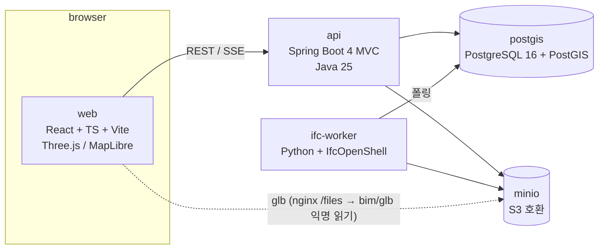

# 01. 아키텍처

## 컨테이너 구성 (docker compose)



| 서비스 | 이미지 | 역할 |
|---|---|---|
| `web` | node 빌드 → nginx 정적 서빙 | UI. API 프록시(`/api`), MinIO 프록시(`/files`) |
| `api` | eclipse-temurin:25 | 모델/요소/공간/지도/FMS API, SSE 진행상태, 잡 등록 |
| `ifc-worker` | python:3.13-slim + IfcOpenShell 0.8.5 (pip) | IFC → glb, 요소/속성/공간계층/지리참조 추출, (M5) IDS 검증 |
| `postgis` | postgis/postgis:16-3.4 | 메타데이터, 요소 속성(jsonb), 공간 데이터, 잡 큐 |
| `minio` | minio/minio | IFC 원본, glb, 썸네일 |

컨테이너 5개. Redis·메시지 브로커·별도 nginx 없음 — [ADR 0003](adr/0003-db-table-queue.md).

## 데이터 흐름: 업로드 → 뷰어

```mermaid
sequenceDiagram
  participant W as web
  participant A as api
  participant S as minio
  participant P as postgis
  participant K as ifc-worker
  W->>A: POST /api/models (multipart IFC)
  A->>S: put ifc/{modelId}.ifc
  A->>P: insert model(UPLOADED), conversion_job(PENDING)
  A-->>W: 201 {modelId}
  W->>A: GET /api/models/{id}/events (SSE)
  K->>P: SELECT job FOR UPDATE SKIP LOCKED → RUNNING
  K->>S: get ifc
  K->>K: IfcOpenShell: geom → glb, 요소/Pset/공간계층/지리참조 추출
  K->>S: put gltf/{modelId}.glb
  K->>P: bulk insert element, spatial_node; update model(READY, footprint)
  K->>P: job DONE (progress 0→100 중간 갱신)
  A-->>W: SSE progress / READY
  W->>S: GET /files/bim/glb/{id}.glb (nginx 프록시, 익명 읽기)
```

진행률은 worker가 `conversion_job.progress`를 갱신하고 api가 1초 간격 폴링해 SSE로 내보낸다. LISTEN/NOTIFY는 필요해지면 교체.

## 모듈 경계

### api (Gradle 단일 모듈, 패키지로 분리)

```
com.bim.api
  model/      업로드, 상태, 목록, SSE
  element/    요소 조회, 속성, 검색 (jsonb)
  spatial/    Site/Building/Storey/Space 트리
  geo/        프로젝트 위치, 풋프린트 GeoJSON, 수동 핀
  fm/         asset, inspection, work_order
  job/        conversion_job 등록/조회
  storage/    MinIO 클라이언트 (S3 SDK). glb 는 `bim/glb/` 프리픽스 익명 읽기라 presigned 불필요, source.ifc 는 비공개
```

멀티모듈은 안 한다. 패키지 하나가 커지면 그때 분리.

### ifc-worker (Python 단일 패키지)

```
worker/
  main.py        폴링 루프
  convert.py     ifcopenshell.geom iterator + serializers.gltf → glb (ADR 0005)
  extract.py     요소·Pset·공간계층·계통(IfcSystem)·흐름 연결(IfcRelConnectsElements) → rows
  georef.py      IfcMapConversion(단위 스케일·회전·EPSG, pyproj) / IfcSite RefLat·RefLong(DMS) → 4326. 풋프린트 = 기하 XY bbox
  ids.py         (M5) ifctester
```

### web (Vite + React + TS)

```
src/
  App.tsx        해시 라우팅: #/ 목록 · #/models/{id} 뷰어 · #/models/{id}/fm 시설관리
  FmPage.tsx     작업지시 보드 · 자산 대장 → 뷰어(?wo=&v=&sel=&clip=)
  MapPage.tsx    #/map MapLibre + OSM 타일, 풋프린트 레이어(자동/수동 색 구분), 클릭 팝업, 미배치 모델 지도 클릭 배치
  viewer/   scene.ts (Three.js 씬·분류·필터·병합·픽킹·섹션박스·측정·뷰포인트·기즈모) + Viewer.tsx (레이아웃·툴바·속성) + LeftPanel.tsx (트리 탭·눈/솔로 토글·검색) + ColorPanel.tsx (속성별 색상 범례) + ContextMenu.tsx (우클릭 메뉴) + FmPanel.tsx (자산 등록·점검·작업지시) + SystemPanel.tsx (계통 목록·색·상류/하류 추적)
            뷰포인트 URL: #/models/{id}?v=px,py,pz,tx,ty,tz&sel={GlobalId}&clip=xmin,xmax,ymin,ymax,zmin,zmax — M4 work_order.viewpoint 와 같은 필드
  map/      MapLibre, 풋프린트 레이어, 핀 배치
  api/      fetch 래퍼, SSE 훅
```

## API 개요 (v1)

| Method | Path | 설명 |
|---|---|---|
| POST | `/api/projects` | 프로젝트 생성 (이름, 위치 선택) |
| GET | `/api/projects` | 목록 + 위치 GeoJSON |
| POST | `/api/projects/{pid}/models` | IFC 업로드 |
| GET | `/api/models/{id}` | 상태, glb URL, 스키마, 풋프린트 |
| GET | `/api/models/{id}/events` | SSE 진행 상태 |
| POST | `/api/models/{id}/retry` | FAILED 모델 잡 재등록 |
| GET | `/api/models/{id}/spatial` | 공간 계층 트리 |
| GET | `/api/models/{id}/elements?ifcClass=&storey=&q=` | 요소 검색 (속성 제외, 가벼운 목록) |
| GET | `/api/models/{id}/property-keys` · `/property-values?key=Pset.Prop` | 뷰어 색상 모드: 키 목록(상위 200)·키별 값 |
| GET | `/api/models/{id}/elements/{globalId}` | 요소 + Pset. GlobalId 는 모델 안에서만 유일(같은 파일 재업로드 시 중복)이라 모델 스코프 |
| PUT | `/api/models/{id}/footprint` | 수동 핀 {lon,lat,rotation} → 로컬 bbox 폭의 사각 풋프린트(aeqd 투영) |
| GET | `/api/map/footprints?bbox=` | 지도용 GeoJSON FeatureCollection (출처·CRS·면적 포함) |
| GET/POST | `/api/models/{id}/assets` | 자산 목록(연결 요소·최근 점검·열린 작업지시 수) / 등록(globalId 선택, tag 중복 409) |
| GET/PATCH/DELETE | `/api/assets/{id}` | 자산 상세(점검·작업지시 포함) / 상태·분류 변경 / 삭제(점검·작업지시 CASCADE) |
| POST | `/api/assets/{id}/inspections` | 점검 기록 OK·DEFECT |
| GET | `/api/models/{id}/work-orders?status=` | 작업지시 보드 |
| POST | `/api/assets/{id}/work-orders` | 작업지시 생성 (viewpoint jsonb = 뷰어 URL 과 같은 필드) |
| GET/PATCH | `/api/work-orders/{id}` | 상세 / 상태·담당·기한 변경 |
| GET | `/api/models/{id}/systems` · `/systems/{sid}/elements` | 설비 계통 목록·멤버 |
| GET | `/api/models/{id}/elements/{globalId}/route?dir=up\|down` | 흐름 추적 (재귀 CTE, 원천까지 / 말단까지) |

## glb ↔ 요소 매핑

glb 노드 이름 = IFC GlobalId (serializer `use-element-guids`, ADR 0005). 프론트는 raycast 히트 노드의 이름으로 `/api/models/{id}/elements/{globalId}` 조회. 별도 ID 매핑 테이블 없음.

## 에러 처리

- DB 제약(CHECK/UNIQUE/FK) 위반 → `ApiErrors` 가 400 으로 매핑. 상태 enum 검증을 앱이 아니라 DB 에 두는 결정([02-data-model](02-data-model.md))의 짝.

- 변환 실패 → `model.status=FAILED`, `conversion_job.error` 에 stderr 마지막 2KB. UI에 표시, 재시도 버튼(잡 재등록)
- worker 크래시·hang → `RUNNING` 인데 `started_at` 10분 경과한 잡은 다시 PENDING. 기동 시가 아니라 **매 폴링 회전마다** 실행 (IfcOpenShell이 대형 파일에서 멈추는 경우 컨테이너는 살아 있음). 재시도 횟수 3회 초과 시 FAILED
- 업로드 크기 제한 500MB (nginx/api 동일 값)

## 테스트

- api: Testcontainers(PostGIS) 기반 통합 테스트, WebTestClient
- worker: 샘플 IFC 3종(2x3 / 4 / 4x3, buildingSMART 공개 샘플)으로 추출 결과 스냅샷 테스트
- web: Playwright 1 시나리오 (업로드 → READY → 요소 클릭)
