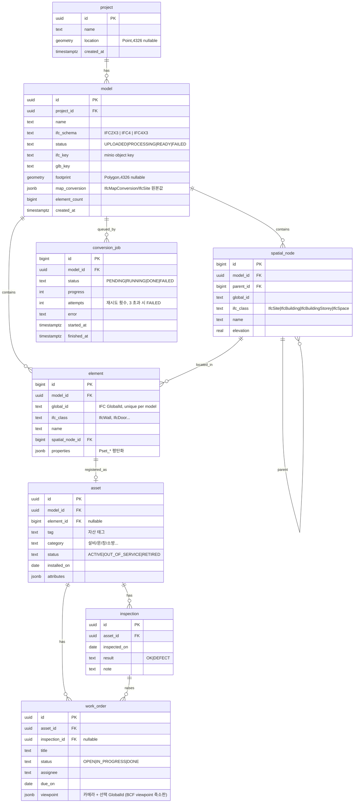

# 02. 데이터 모델

## 설계 근거

- **element.properties jsonb**: Pset 종류가 모델마다 다르다. 정규화하면 테이블 폭발. GIN 인덱스(`jsonb_path_ops`)로 `properties @> '{"Pset_WallCommon":{"IsExternal":true}}'` 조회.
- **spatial_node adjacency list**: 깊이 최대 4(Site→Building→Storey→Space). 재귀 CTE로 충분. ltree 안 씀.
- **asset ↔ element 선택적 FK**: IFC에 없는 자산(추가 설치 장비)도 등록 가능. 그래서 `asset.model_id`를 따로 둔다 — element가 NULL이어도 어느 모델(건물) 소속인지는 알아야 한다. COBie의 Component–Type 관계는 `category` + `attributes`로 단순화. COBie 정식 내보내기는 M5.
- **work_order.viewpoint**: BCF 3.0 viewpoint(카메라·컴포넌트 선택)를 jsonb로 축소 저장. BCF 파일 포맷 자체는 만들지 않음.
- **footprint 계산**: 지리참조가 있으면 IfcSite 하위 IfcBuilding 요소의 XY 바운딩 박스(또는 convex hull)를 EPSG 변환 후 저장. 없으면 NULL, UI에서 수동 핀(Point) → `project.location`.
- **conversion_job 1:N**: 재시도는 새 행 insert. 실패 이력이 남고 `model.status`는 최신 잡 기준.
- **인덱스**: `element(model_id, ifc_class)`, `element(model_id, global_id)` unique, `model USING GIST(footprint)`, `conversion_job(status)`.
- **ifc_schema 정규화**: 헤더 `FILE_SCHEMA`는 `IFC4X3_ADD2`, `IFC4X1` 처럼 접미가 붙는다. 접두 매칭(`IFC2X3` / `IFC4X3` / 그 외 `IFC4` 시작 → `IFC4`)으로 3값 중 하나만 저장.
- **제약은 DB에**: status/result 류는 전부 `CHECK`, `asset UNIQUE(model_id, tag)`, `element UNIQUE(model_id, global_id)`. 앱 코드에서 enum 검증 안 함.
- **삭제 전파**: 소유 관계(model→element 등)는 `ON DELETE CASCADE`, 참조 관계(`element.spatial_node_id`, `asset.element_id`, `work_order.inspection_id`)는 `SET NULL`.
- **마이그레이션**: Flyway (api 기동 시, `api/src/main/resources/db/migration`). worker는 스키마를 소유하지 않는다. **이 문서와 V1 SQL은 1:1** — 둘 중 하나 바꾸면 나머지도.
