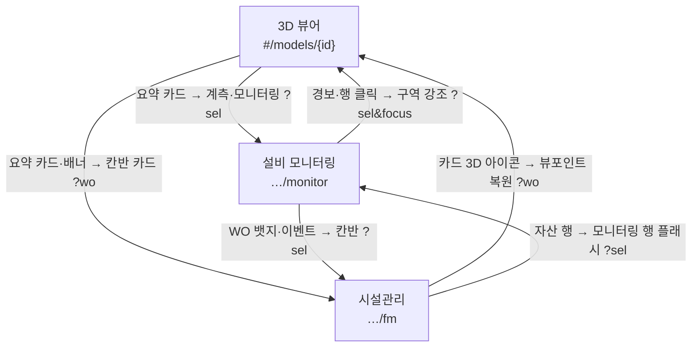
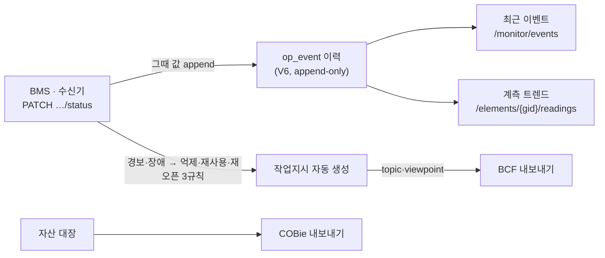

# 화면 설계서

다섯 화면(SPA 해시 라우팅)에 기능이 어디에 놓이고 서로 어떻게 이어지는지 정리한 문서.
**NEW** 표기는 2026-08-31 추가분 — 이벤트 이력(op_event) · 계측 트렌드 · 점검 주기 · COBie/BCF 내보내기.

## 1. 화면 맵

| 화면 | 경로 | 역할 |
|---|---|---|
| 모델 목록 | `#/` | IFC 업로드(드래그) → 변환 진행률(SSE) → 모델별 뷰어·모니터링·시설관리 진입. 앱의 현관 |
| 3D 뷰어 | `#/models/{id}` | 공간 탐색의 중심 — 요소 선택 → 요약 카드, 계통 추적, 정전 시나리오, 경보 포커스, 측정·단면 |
| 설비 모니터링 | `#/models/{id}/monitor` | "지금 건물이 어떤가"에 답하는 관제 화면. 5초 갱신. `?kiosk=1` 벽면 모드 |
| 시설관리 | `#/models/{id}/fm` | "무엇을 처리할 것인가"의 업무 화면 — 작업지시 칸반 + 자산 대장 |
| GIS 지도 | `#/map` | 여러 건물의 부지 풋프린트. 단지 관점 진입점(보조) |

역할 분담이 곧 배치 원칙이다: **뷰어=어디, 모니터링=지금, 시설관리=할 일.** 기능은 그 질문에 답하는 화면에 놓는다.

## 2. 화면 간 연관 관계

모든 이동은 해시 쿼리 딥링크(`?sel=&focus=1`, `?wo=`, `?clip=`)이고 뷰어는 씬 재로드 없이 재적용한다.
전역 경보 토스트(5초 폴링)는 어느 화면에서든 세 화면으로 점프하는 우회로다.



### 데이터가 화면을 잇는 길 (NEW)

상태 PATCH 한 줄이 이벤트·트렌드·작업지시·표준 내보내기까지 흘러간다.
이력(`op_event`, V6)이 생기면서 "언제부터 이랬나"에 답할 수 있게 됐다.



### 객체 맥락 (2026-09-02)

선택 객체는 URL `?sel=` 하나로 세 화면을 관통한다. 내비 링크가 `sel` 을 유지하고, 모니터링·시설관리는 `sel` 이 있으면 우측 **객체 패널**(뷰어 우측 패널과 같은 내용: `ObjectSummary`·`StatusEditor`·`FmPanel`)을 띄우며, 세 화면 좌하단의 **맥락 독**(`ObjectDock`)이 뷰어가 남긴 3D 스냅샷 썸네일·상태·팀·위치와 3D/모니터링/카드 링크, 최근 객체 칩을 보여준다. 모니터링 행 클릭은 같은 화면의 객체 패널(뷰어 이동은 행의 3D 아이콘), `fm?sel=` 은 객체 패널(카드는 패널 안 작업지시 목록에서). 벽면(kiosk)에선 둘 다 없음.

## 3. 설비 모니터링 — 관제의 우선순위 순서

위에서 아래로 **총계 → 팀 → 처리할 것 → 핵심 장비 → 전체 격자**. 요약이 먼저, 상세가 나중. 우측 이벤트 열만 시간축이다.

```text
┌─────────────────────────────────────────────────────┬──────────────┐
│ 건물 총계 — 경보·장애·계측 주의·작업지시·전원·주차     │              │
├─────────────────────────────────────────────────────┤ 최근 이벤트   │
│ 팀 현황 — 카드=팀 필터, 점검 지연 건수 NEW             │ (op_event    │
├─────────────────────────────────────────────────────┤  시간순) NEW │
│ 지금 처리할 것 — 경보→장애→계측 위험→주의→지연 NEW    │              │
├─────────────────────────────────────────────────────┤ 클릭 →       │
│ 핵심 장비 카드 (팀 선택 시) — 계측값 + 📈 트렌드 NEW  │ 뷰어/칸반    │
├─────────────────────────────────────────────────────┤              │
│ 층 × 팀 격자 — 이상만/장비/전체, 행 📈 NEW            │              │
└─────────────────────────────────────────────────────┴──────────────┘
```

- **최근 이벤트 (NEW)** — `op_event` 이력을 읽는다. 이전에는 현재값에서 유도해 다음 변경 때 사라졌다.
- **계측 트렌드 모달 (NEW)** — 숫자 계측값이 있는 행·카드에 📈 아이콘. 키별 미니 라인차트(hover 크로스헤어), 값·시각은 텍스트로, warn/crit일 때만 경고색.
- **점검 지연 노출 (NEW)** — 총계 줄·팀 카드에 건수, "지금 처리할 것" 끝(긴급도 최하위)과 행 뱃지. ACTIVE 자산만 센다.
- **키오스크 (NEW)** — 이벤트 열 300→400px. 벽면에서는 "최근 무슨 일"이 격자보다 자주 읽힌다.
- 기존: 새 경보 4초 플래시 + 알림음, `?sel=` 행 스크롤·플래시, 층 라벨 클릭 = 층 필터, 층 단면 링크.

## 4. 시설관리 — 할 일과 대장

```text
┌───────────────────────────────────────────────────────────────┐
│ 요약 — 자산 · 점검 완료(미점검·지연 NEW) · 열린 작업지시        │
├───────────────────────────────────────────[BCF 내보내기 NEW]──┤
│ 작업지시 보드(칸반)  대기 │ 진행 │ 완료(접힘)                   │
│   카드: 우선순위·담당·기한·3D — 드래그 이동 + 되돌리기          │
├─────────────────────────────────────────[COBie 내보내기 NEW]──┤
│ 자산 대장 — 검색·분류·층·지연 NEW 필터                         │
│   행: 태그·분류·층·요소·상태·최근 점검·다음 점검 NEW·WO         │
└───────────────────────────────────────────────────────────────┘
```

- **점검 주기 (NEW)** — 자산 행에서 개월 입력(0=해제). 다음 점검일 = 마지막 점검(없으면 설치일→오늘)+주기. 지연은 붉게, 필터·요약·섹션 헤더에 건수.
- **COBie 내보내기 (NEW)** — Facility·Floor·Space·Type·Component·Job CSV zip. 자산 대장 헤더.
- **BCF 내보내기 (NEW)** — 작업지시→topic, 뷰포인트→카메라·선택 요소. 보드 우상단.
- 내보내기 버튼은 **데이터가 사는 섹션 헤더**에 둔다 — 전역 "내보내기 메뉴"를 만들지 않는다.

## 5. 3D 뷰어 — 배치만 요약

```text
┌──────────────────────────────────────────────────────────────┐
│ ┌상태판(이상 목록)┐                    ┌요약 카드(선택 요소)─┐ │
│ ├탭: 트리·계통──┤       3D 캔버스      │ 이름·상태·계통·자산·WO│ │
│ │  자산·색상     │                     │ 운영 상태 편집 📈 NEW │ │
│ │  계통: 추적·   │                     │ → 칸반·모니터링 링크  │ │
│ │  정전·색칠     │  ┌플로팅 툴바────┐  └─────────────────────┘ │
│ └───────────────┘  │측정·단면·그리드│                          │
└────────────────────┴───────────────┴──────────────────────────┘
```

계통 탭은 계통(IfcSystem)이 없는 실무 IFC에서도 포트 연결만 있으면 상류·하류 추적이 된다(scope=all 폴백). 요약 카드 아래 운영 상태 헤더에 📈 트렌드 진입(NEW) — 현장에서 요소를 보며 "언제부터 이랬나"를 바로 연다. 요약 카드는 모니터·칸반으로 나가는 정방향 링크의 출발점이다.
경보 포커스(`?sel=&focus=1`)는 건물 전체 뷰를 유지한 채 구역 강조 + 지붕 비콘.

## 6. 신규 기능 배치표

| 기능 | 화면 · 위치 | 왜 거기인가 | API · 저장 |
|---|---|---|---|
| 이벤트 이력 | 모니터링 우측 "최근 이벤트" | 기존 자리 유지, 소스만 유도값→이력으로 (유실 수정) | `GET /monitor/events` ← `op_event`(V6) |
| 계측 트렌드 | 핵심 장비 카드·격자 행 📈, 뷰어 운영 상태 헤더 📈 → 모달 | 현재값이 보이는 자리에서 "언제부터?"로 확장 | `GET /elements/{gid}/readings` ← `op_event.data` |
| 점검 주기·지연 | 자산 대장 (주기 입력·다음 점검 열·지연 필터) | 점검 이력이 사는 대장에서 예방정비로 확장 | `PATCH /assets/{id}` → `attributes.intervalMonths` |
| COBie 내보내기 | 자산 대장 헤더 버튼 | 인수인계 산출물 = 자산 데이터의 출구 | `GET /export/cobie` (CSV zip) |
| BCF 내보내기 | 작업지시 보드 우상단 버튼 | 이슈(작업지시)의 출구 — 조정 도구로 되넘김 | `GET /export/bcf` (topic·viewpoint) |
| 경보 통계 (NEW 09-02) | 모니터링 맨 아래 접이식 "경보 통계" (기본 접힘, 7·30·90일) | 격자는 '지금', 통계는 '얼마나 자주·얼마나 오래' — 관제의 마지막 질문. 팀별 표 + 재발 상위 → 뷰어 포커스 | `GET /monitor/stats?days=` ← `op_event` 전이 분석 (정상→이상 에피소드·복구 시각). 팀 합계는 `monitor.ts teamStats` |

## 7. 배치 원칙

1. **질문이 화면을 고른다** — 어디(뷰어) · 지금(모니터링) · 할 일(시설관리).
2. **요약 → 상세, 이상 → 정상** 순서. 관제 화면은 스크롤 없이 첫 줄에서 판단이 서야 한다.
3. **이동은 전부 해시 딥링크** — 공유·북마크 가능, 씬 재로드 없음. 새 기능도 기존 `?sel=` 체계 재사용.
4. **내보내기는 데이터가 사는 섹션에.**
5. **파생값은 서버가 계산** — 다음 점검일, 수신기 집계, 이벤트 이력. 화면은 그리기만.

## 8. 열린 질문 — 반영됨 (2026-08-31)

세 건 모두 반영했다.

- ✅ **뷰어 트렌드 진입** — 운영 상태 헤더의 📈 (숫자 계측값이 있는 요소만).
- ✅ **점검 지연의 모니터링 노출** — 총계 줄·팀 카드 건수, "지금 처리할 것" 최하위 순위, 행 "점검 지연" 뱃지.
- ✅ **키오스크 이벤트 열 확대** — 300→400px.

## 9. 코드 위치 (2026-09-02 정비 후)

화면과 규칙이 어느 파일에 사는지. 여러 화면이 같이 쓰는 규칙은 **한 파일**에만 있다 — 고칠 때 그 파일만 고치면 된다.

| 무엇 | 파일 | 비고 |
|---|---|---|
| 모델 목록·라우팅 | `web/src/App.tsx` | 해시 라우팅 (`#/models/{id}`, `/monitor`, `/fm`, `#/map`) |
| 3D 뷰어 | `web/src/viewer/Viewer.tsx` + `scene.ts`(Three) · `NavCube.ts` · `chrome.tsx`(플로팅·툴바) · `Props.tsx`(속성 표) · `LeftPanel.tsx` · `SystemPanel.tsx` · `FmPanel.tsx` · `StatusEditor.tsx` · `ColorPanel.tsx` | 딥링크 `?v= sel= clip= focus= wo= fm=` |
| 설비 모니터링 | `web/src/MonitorPage.tsx` (화면) + `monitor.ts` (순수 로직: 우선순위 `rank`·점검 지연·핵심 장비·경보 통계 팀 합계 `teamStats`) | `monitor.test.ts` 가 순서·합계를 고정 |
| 시설관리 | `web/src/FmPage.tsx` (대장) + `FmBoard.tsx` (칸반) | |
| 지도 | `web/src/MapPage.tsx` | |
| 계측 트렌드 | `web/src/TrendModal.tsx` | 모니터링·뷰어 공용 |
| **객체 맥락** | `web/src/context.ts`(`?sel=` 링크·최근·스냅샷 캐시) · `useObject.ts` · `ObjectSummary.tsx` · `ObjectDrawer.tsx` · `ObjectDock.tsx` · `viewer/scene.ts snapshot()` | `context.test.ts` |
| 전역 경보 토스트 | `web/src/useAlerts.tsx` | 5초 폴링 + diff |
| **상태 → 라벨·색** | `web/src/status.ts` | 모든 화면 공용 (`STATUS`, `statusLabel`, `statusHex`, `WO_STATUS`) |
| **팀 ↔ 계통 매핑** | `web/src/teams.ts` | 조명제어반→전기팀 예외 포함 |
| **계측값 사전·등급** | `web/src/readings.ts` | 집수정·오수 수위 반전 포함, `readings.test.ts` |
| 날짜·점검 지연 규칙·Esc·기본 스타일 | `web/src/ui.ts` | `inspectionOverdue` 는 대장·모니터링 공용 |
| API 호출·응답 타입 | `web/src/api.ts` | `api<T>()` — 응답 타입은 호출부가 선언 |
| **공유 SQL 조각** | `api/…/Sql.java` | 선(배관) 제외 목록, 다음 점검일, 층/구역 조인, 계통 스코프 CTE |
| API 오류 3종 + DB 제약 변환 | `api/…/ApiErrors.java` | |
| API 문서 | `api/…/OpenApiConfig.java` (springdoc) | `localhost:8080/swagger-ui.html` — 경로 32개 자동, 응답 스키마는 `api.ts` 가 계약 |
| 운영 상태·작업지시 규칙·전원 계산 | `api/…/StatusService.java` | `demoAggregates()` 는 가상 건물 전용 |
| 자산·점검·작업지시 | `api/…/FmService.java` | |
| 모니터링·이벤트 API | `api/…/MonitorController.java` | |
| COBie·BCF 내보내기 | `api/…/ExportController.java` | |
| IFC 추출 (계통·연결·포트) | `ifc-worker/worker/extract.py` | `tests/test_ports.py` |
| 변환 잡 루프·lease | `ifc-worker/worker/main.py` | RECOVER SQL 은 api 의 `ConversionJobIntegrationTests` 가 이 파일을 읽어 검증 |
